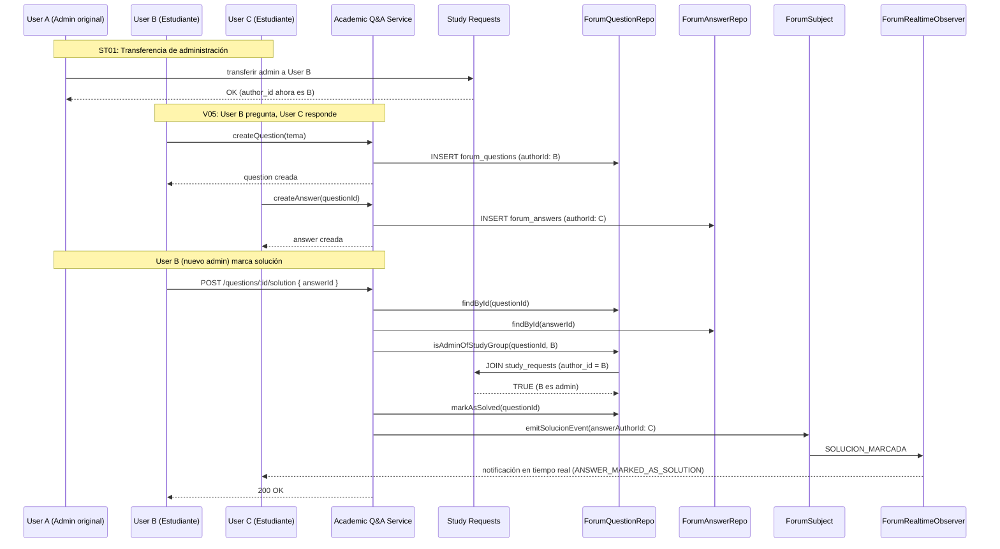
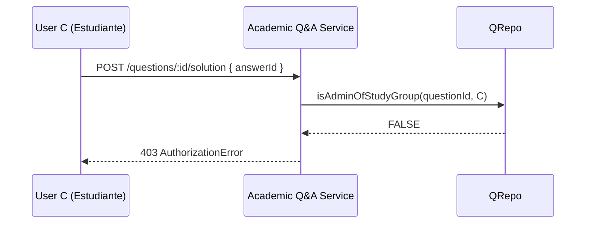

# V05 — Academic Q&A Forum

Chain of Responsibility + Observer para preguntas y respuestas académicas.

## Diagrama de Secuencia — Flujo Completo

## Caso de cortocircuito — Sin permisos

## Endpoints

| Método | Ruta | Descripción |
|--------|------|-------------|
| POST | `/api/v1/forum/questions` | Crear pregunta |
| GET | `/api/v1/forum/questions?subjectId=&page=&limit=` | Listar preguntas |
| GET | `/api/v1/forum/questions/:questionId` | Detalle de pregunta |
| POST | `/api/v1/forum/questions/:questionId/answers` | Crear respuesta |
| GET | `/api/v1/forum/questions/:questionId/answers` | Listar respuestas |
| POST | `/api/v1/forum/questions/:questionId/solution` | Marcar respuesta como solución |
| POST | `/api/v1/forum/votes` | Votar (upvote/downvote) |

## Validaciones (Chain of Responsibility)

1. **EnrollmentValidator** — Usuario debe estar matriculado en la asignatura
2. **FormatValidator** — Título ≤ 200 chars, cuerpo ≤ 5000 chars
3. **ContentValidator** — Sin palabras prohibidas (spam, ofensa)
4. **AdminCheck** (en MarcarComoSolucion) — Solo el autor del `study_request` o miembros de `study_request_admins`
