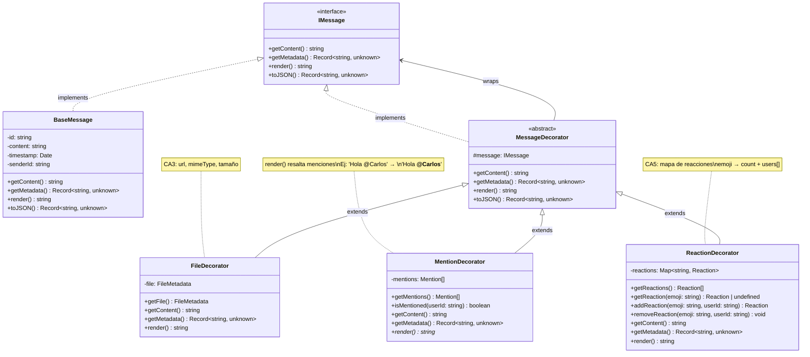

# Messaging Service

Microservicio del dominio de mensajeria privada 1:1 de UniConnect.

## Alcance

Este servicio cubre:

- Conversaciones privadas entre dos usuarios.
- Envio y lectura de mensajes.
- Mensajes de texto y multimedia (imagen/audio).
- Respuesta a mensajes (reply).
- Compatibilidad con esquema nuevo y esquema legado.

## Integracion End-to-End

Flujo completo en produccion/local:

1. Frontend sube archivo a Supabase Storage.
2. Frontend envia metadatos al gateway (`/api/v1/messages`).
3. Gateway reenvia a `@uniconnect/messaging`.
4. Messaging valida permisos/entrada y persiste en Postgres.
5. Frontend consulta conversaciones/mensajes desde gateway.

### Piezas involucradas

- Frontend:
	- `frontend/app/chat/[conversationId].tsx`
	- `frontend/components/chat/ChatInput.tsx`
	- `frontend/components/chat/MessageBubble.tsx`
	- `frontend/lib/services/infrastructure/chatMediaUpload.ts`
- Gateway:
	- proxy de `/api/v1/conversations*` y `/api/v1/messages*`
- Messaging:
	- `backend/services/messaging/src/**`
- Storage y migraciones:
	- `backend/supabase/migrations/20260319_messaging_media.sql`
	- `backend/supabase/migrations/20260319_chat_audio_bucket.sql`

## Arquitectura

Clean Architecture por capas:

- `src/domain`: entidades y contratos.
- `src/application`: casos de uso.
- `src/infrastructure`: repositorios (`Postgres` + `InMemory`).
- `src/interfaces`: controlador HTTP, DTOs, rutas y autenticacion.

Entry point:

- `src/main.ts`: carga configuracion, arma dependencias y levanta servidor.

## Patrón Decorator para Mensajes

El dominio implementa el **Patrón Decorator** para composición flexible de características de mensajes:

### Descripción

Los decoradores permiten agregar funcionalidades dinámicamente a mensajes sin modificar la clase base:
- **BaseMessage**: Mensaje base con content, userId, timestamp
- **FileDecorator**: Agrega metadata de archivos (filename, size, mimeType, url)
- **MentionDecorator**: Agrega menciones de usuarios, sobrescribe `render()` para resaltar
- **ReactionDecorator**: Agrega mapa de reacciones (emojis)

### Características

✅ **Componibles**: Los decoradores pueden anidarse en cualquier orden  
✅ **Interfaz uniforme**: Todos implementan `IMessage` con `getContent()`, `getMetadata()`, `render()`  
✅ **Respeta el Principio de Responsabilidad Única**: Cada decorador agrega una sola característica  
✅ **Altamente extensible**: Nuevos decoradores sin modificar existentes  

### Diagrama UML



### Ejemplo de Composición

```typescript
// Crear mensaje base
const base = new BaseMessage({
  id: "msg-001",
  content: "Hola @Carlos, aquí está el PDF",
  timestamp: new Date(),
  senderId: "user-123",
});

// Agregar archivo
const withFile = new FileDecorator(base, {
  filename: "documento.pdf",
  size: 512000,
  mimeType: "application/pdf",
  url: "https://storage.example.com/doc.pdf",
});

// Agregar menciones
const withMentions = new MentionDecorator(withFile, [
  { userId: "user-456", displayName: "Carlos", position: 6 },
]);

// Agregar reacciones
const final = new ReactionDecorator(withMentions, [
  { emoji: "👍", count: 3, users: ["user-1", "user-2", "user-3"] },
]);

// Usar
console.log(final.render()); // "Hola **@Carlos**, aquí está el PDF"
console.log(final.getMetadata());
// {
//   id: "msg-001",
//   content: "Hola @Carlos, aquí está el PDF",
//   senderId: "user-123",
//   timestamp: "...",
//   file: { filename: "documento.pdf", ... },
//   mentions: [{ userId: "user-456", displayName: "Carlos", position: 6 }],
//   reactions: [{ emoji: "👍", count: 3, users: [...] }]
// }
```

### Ubicación

- Interfaz: `src/domain/decorators/IMessage.ts`
- Clase base: `src/domain/decorators/BaseMessage.ts`
- Clase abstracta: `src/domain/decorators/MessageDecorator.ts`
- Decoradores: 
  - `src/domain/decorators/FileDecorator.ts`
  - `src/domain/decorators/MentionDecorator.ts`
  - `src/domain/decorators/ReactionDecorator.ts`
- Tests: `src/domain/decorators/decorator.test.ts`

## Persistencia y compatibilidad

El servicio selecciona repositorio en runtime:

- `PostgresMessagingRepository` cuando la configuracion de DB es valida.
- `InMemoryMessagingRepository` como fallback en entornos sin DB.

Ademas, el repositorio Postgres contempla dos escenarios:

- Esquema nuevo: columnas `media_url`, `media_type`, `media_filename`, `reply_*`.
- Esquema legado: fallback de insercion/lectura cuando esas columnas aun no existen.

Esto evita caidas si la migracion de multimedia no se ha ejecutado en todos los entornos.

## Autenticacion y autorizacion

Identidad del actor:

- Header `x-user-id`, o
- `sub` del JWT en `Authorization: Bearer <token>`.

Reglas de acceso:

- Solo participantes de una conversacion pueden verla.
- Solo participantes pueden listar/enviar mensajes en esa conversacion.
- Solo participantes pueden marcar mensajes como leidos.

## API HTTP

Base path: `/api/v1`

### Conversaciones

- `GET /api/v1/conversations`
- `GET /api/v1/conversations/:id`
- `POST /api/v1/conversations`
	- body: `{ "participantB": "<userId>" }`
- `PATCH /api/v1/conversations/:id/touch`

### Mensajes

- `GET /api/v1/messages?conversationId=<id>&limit=50&offset=0`
- `GET /api/v1/messages/:id`
- `POST /api/v1/messages`
	- body minimo: `{ "conversationId": "<id>", "content": "texto" }`
	- body multimedia:
		- `mediaUrl`
		- `mediaType`
		- `mediaFilename`
		- `replyToMessageId`
		- `replyPreview`
- `PATCH /api/v1/conversations/:id/read` — Marcar todos los mensajes no leidos de una conversacion como leidos (solo emisarios de otros usuarios)
- `PATCH /api/v1/messages/:id/read`

### Health

- `GET /health`

## Migraciones necesarias

Para funcionalidad multimedia completa:

1. Ejecutar `backend/supabase/migrations/20260319_messaging_media.sql`.
2. Ejecutar `backend/supabase/migrations/20260319_chat_audio_bucket.sql`.

La segunda migracion crea el bucket `chat-audio` con MIME permitidos para notas de voz y politicas RLS de `storage.objects`.

## Variables de entorno

Revisar `.env.example` del servicio.

Claves principales:

- `PORT`, `NODE_ENV`
- `DB_HOST`, `DB_PORT`, `DB_NAME`, `DB_USER`, `DB_PASSWORD`, `DB_SSL`

En gateway:

- `MESSAGING_BASE_URL=http://localhost:3104`

## Ejecucion local

Desde `backend/`:

1. `pnpm install`
2. `pnpm --filter @uniconnect/messaging dev`

Con gateway:

1. `pnpm --filter @uniconnect/gateway dev`
2. Consumir endpoints via `http://localhost:3000/api/v1/...`

## Verificacion rapida

1. Crear/obtener conversacion.
2. Enviar mensaje de texto.
3. Enviar imagen (con `mediaUrl`).
4. Enviar audio (con `mediaType` de audio).
5. Confirmar lectura y listado de conversaciones.

## Scripts utiles

- `pnpm --filter @uniconnect/messaging dev`
- `pnpm --filter @uniconnect/messaging build`
- `pnpm --filter @uniconnect/messaging start`
- `pnpm --filter @uniconnect/messaging typecheck`
