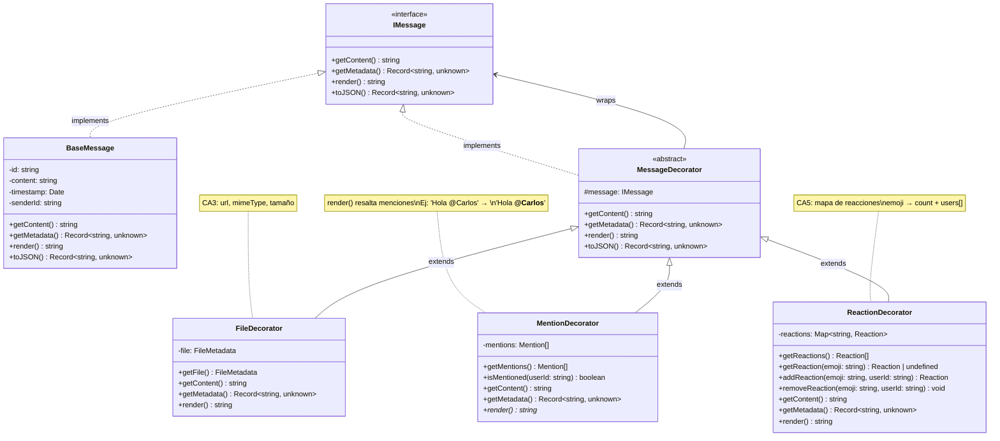
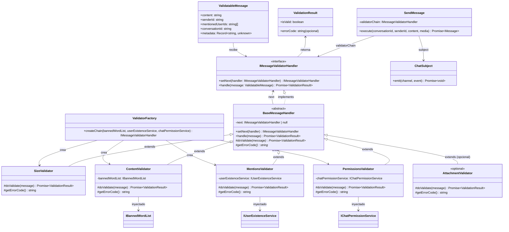
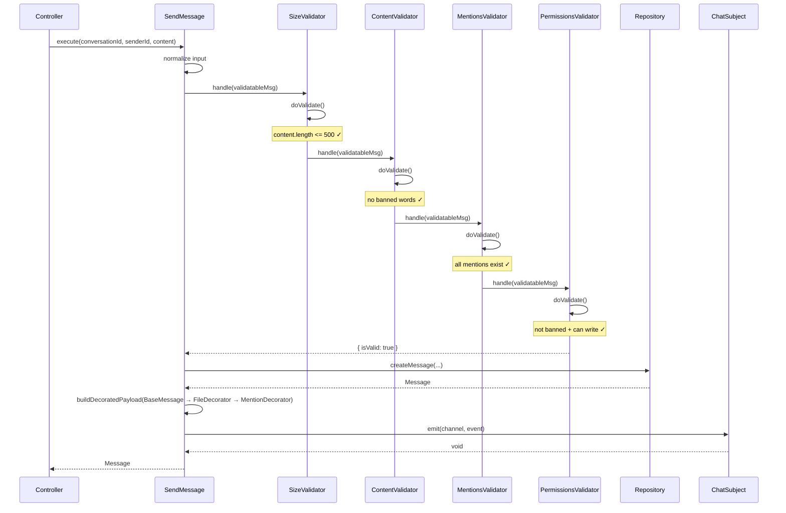

# Messaging Service

Microservicio del dominio de mensajeria privada 1:1 de UniConnect.

## Alcance

Este servicio cubre:

- Conversaciones privadas entre dos usuarios.
- Envio y lectura de mensajes.
- Mensajes de texto y multimedia (imagen/audio).
- Respuesta a mensajes (reply).
- Compatibilidad con esquema nuevo y esquema legado.

## Integracion End-to-End

Flujo completo en produccion/local:

1. Frontend sube archivo a Supabase Storage.
2. Frontend envia metadatos al gateway (`/api/v1/messages`).
3. Gateway reenvia a `@uniconnect/messaging`.
4. Messaging valida permisos/entrada y persiste en Postgres.
5. Frontend consulta conversaciones/mensajes desde gateway.

### Piezas involucradas

- Frontend:
	- `frontend/app/chat/[conversationId].tsx`
	- `frontend/components/chat/ChatInput.tsx`
	- `frontend/components/chat/MessageBubble.tsx`
	- `frontend/lib/services/infrastructure/chatMediaUpload.ts`
- Gateway:
	- proxy de `/api/v1/conversations*` y `/api/v1/messages*`
- Messaging:
	- `backend/services/messaging/src/**`
- Storage y migraciones:
	- `backend/supabase/migrations/20260319_messaging_media.sql`
	- `backend/supabase/migrations/20260319_chat_audio_bucket.sql`

## Arquitectura

Clean Architecture por capas:

- `src/domain`: entidades y contratos.
- `src/application`: casos de uso.
- `src/infrastructure`: repositorios (`Postgres` + `InMemory`).
- `src/interfaces`: controlador HTTP, DTOs, rutas y autenticacion.

Entry point:

- `src/main.ts`: carga configuracion, arma dependencias y levanta servidor.

## Patrón Decorator para Mensajes

El dominio implementa el **Patrón Decorator** para composición flexible de características de mensajes:

### Descripción

Los decoradores permiten agregar funcionalidades dinámicamente a mensajes sin modificar la clase base:
- **BaseMessage**: Mensaje base con content, userId, timestamp
- **FileDecorator**: Agrega metadata de archivos (filename, size, mimeType, url)
- **MentionDecorator**: Agrega menciones de usuarios, sobrescribe `render()` para resaltar
- **ReactionDecorator**: Agrega mapa de reacciones (emojis)

### Características

✅ **Componibles**: Los decoradores pueden anidarse en cualquier orden  
✅ **Interfaz uniforme**: Todos implementan `IMessage` con `getContent()`, `getMetadata()`, `render()`  
✅ **Respeta el Principio de Responsabilidad Única**: Cada decorador agrega una sola característica  
✅ **Altamente extensible**: Nuevos decoradores sin modificar existentes  

### Diagrama UML


```mermaid
classDiagram
    class IMessage {
        <<interface>>
        +getContent() string
        +getMetadata() Record~string, unknown~
        +render() string
        +toJSON() Record~string, unknown~
    }

    class BaseMessage {
        -id: string
        -content: string
        -timestamp: Date
        -senderId: string
        +getContent() string
        +getMetadata() Record~string, unknown~
        +render() string
        +toJSON() Record~string, unknown~
    }

    class MessageDecorator {
        <<abstract>>
        #message: IMessage
        +getContent() string
        +getMetadata() Record~string, unknown~
        +render() string
        +toJSON() Record~string, unknown~
    }

    class FileDecorator {
        -file: FileMetadata
        +getFile() FileMetadata
        +getContent() string
        +getMetadata() Record~string, unknown~
        +render() string
    }

    class MentionDecorator {
        -mentions: Mention[]
        +getMentions() Mention[]
        +isMentioned(userId: string) boolean
        +getContent() string
        +getMetadata() Record~string, unknown~
        +render() string*
    }

    class ReactionDecorator {
        -reactions: Map~string, Reaction~
        +getReactions() Reaction[]
        +getReaction(emoji: string) Reaction | undefined
        +addReaction(emoji: string, userId: string) Reaction
        +removeReaction(emoji: string, userId: string) void
        +getContent() string
        +getMetadata() Record~string, unknown~
        +render() string
    }

    IMessage <|.. BaseMessage : implements
    IMessage <|.. MessageDecorator : implements
    MessageDecorator <|-- FileDecorator : extends
    MessageDecorator <|-- MentionDecorator : extends
    MessageDecorator <|-- ReactionDecorator : extends
    MessageDecorator --> IMessage : wraps

    note for MentionDecorator "render() resalta menciones\nEj: 'Hola @Carlos' → \n'Hola **@Carlos**'"
    note for FileDecorator "CA3: url, mimeType, tamaño"
    note for ReactionDecorator "CA5: mapa de reacciones\nemoji → count + users[]"
```

### Ejemplo de Composición

```typescript
// Crear mensaje base
const base = new BaseMessage({
  id: "msg-001",
  content: "Hola @Carlos, aquí está el PDF",
  timestamp: new Date(),
  senderId: "user-123",
});

// Agregar archivo
const withFile = new FileDecorator(base, {
  filename: "documento.pdf",
  size: 512000,
  mimeType: "application/pdf",
  url: "https://storage.example.com/doc.pdf",
});

// Agregar menciones
const withMentions = new MentionDecorator(withFile, [
  { userId: "user-456", displayName: "Carlos", position: 6 },
]);

// Agregar reacciones
const final = new ReactionDecorator(withMentions, [
  { emoji: "👍", count: 3, users: ["user-1", "user-2", "user-3"] },
]);

// Usar
console.log(final.render()); // "Hola **@Carlos**, aquí está el PDF"
console.log(final.getMetadata());
// {
//   id: "msg-001",
//   content: "Hola @Carlos, aquí está el PDF",
//   senderId: "user-123",
//   timestamp: "...",
//   file: { filename: "documento.pdf", ... },
//   mentions: [{ userId: "user-456", displayName: "Carlos", position: 6 }],
//   reactions: [{ emoji: "👍", count: 3, users: [...] }]
// }
```

### Ubicación

- Interfaz: `src/domain/decorators/IMessage.ts`
- Clase base: `src/domain/decorators/BaseMessage.ts`
- Clase abstracta: `src/domain/decorators/MessageDecorator.ts`
- Decoradores: 
  - `src/domain/decorators/FileDecorator.ts`
  - `src/domain/decorators/MentionDecorator.ts`
  - `src/domain/decorators/ReactionDecorator.ts`
- Tests: `src/domain/decorators/decorator.test.ts`

## Patrón Chain of Responsibility para Validación de Mensajes

El dominio implementa el **Patrón Chain of Responsibility** para validar mensajes antes de publicarlos. Cada validación es un handler independiente que puede cortar la cadena si la regla se viola.

### Descripción

La cadena se construye en un único punto (`ValidatorFactory`) con 4 handlers en orden estricto:

1. **SizeValidator**: Rechaza mensajes que excedan 500 caracteres (`SIZE_EXCEEDED`)
2. **ContentValidator**: Rechaza mensajes con palabras prohibidas (`INVALID_CONTENT`)
3. **MentionsValidator**: Rechaza menciones a usuarios inexistentes (`USER_NOT_FOUND`)
4. **PermissionsValidator**: Rechaza usuarios baneados (`USER_BANNED`) o sin permiso de escritura (`NO_WRITE_PERMISSION`)

### Características

✅ **Handlers independientes**: Cada uno valida un solo aspecto y delega al siguiente
✅ **Cortocircuito**:apenas un handler falla, retorna el error sin ejecutar los siguientes
✅ **Punto único de composición**: La cadena se arma en `ValidatorFactory.createChain()` — el orden es explícito
✅ **Open/Closed**: Nuevos handlers se agregan sin modificar los existentes (solo se cambia la composición)
✅ **Integración con Observer**: Si todas las validaciones pasan, el mensaje se decora y se emite vía `ChatSubject`

### Diagrama UML


```mermaid
classDiagram
    class IMessageValidatorHandler {
        <<interface>>
        +setNext(handler: IMessageValidatorHandler) IMessageValidatorHandler
        +handle(message: ValidatableMessage) Promise~ValidationResult~
    }

    class ValidationResult {
        +isValid: boolean
        +errorCode: string (opcional)
    }

    class ValidatableMessage {
        +content: string
        +senderId: string
        +mentionedUserIds: string[]
        +conversationId: string
        +metadata: Record~string, unknown~
    }

    class BaseMessageHandler {
        <<abstract>>
        -next: IMessageValidatorHandler | null
        +setNext(handler) IMessageValidatorHandler
        +handle(message) Promise~ValidationResult~
        #doValidate(message) Promise~ValidationResult~*
        #getErrorCode() string*
    }

    class SizeValidator {
        #doValidate(message) Promise~ValidationResult~
        #getErrorCode() string
    }

    class ContentValidator {
        -bannedWordList: IBannedWordList
        #doValidate(message) Promise~ValidationResult~
        #getErrorCode() string
    }

    class MentionsValidator {
        -userExistenceService: IUserExistenceService
        #doValidate(message) Promise~ValidationResult~
        #getErrorCode() string
    }

    class PermissionsValidator {
        -chatPermissionService: IChatPermissionService
        #doValidate(message) Promise~ValidationResult~
        #getErrorCode() string
    }

    class AttachmentValidator {
        <<optional>>
        #doValidate(message) Promise~ValidationResult~
        #getErrorCode() string
    }

    class ValidatorFactory {
        +createChain(bannedWordList, userExistenceService, chatPermissionService) IMessageValidatorHandler
    }

    class SendMessage {
        -validatorChain: IMessageValidatorHandler
        +execute(conversationId, senderId, content, media) Promise~Message~
    }

    class ChatSubject {
        +emit(channel, event) Promise~void~
    }

    IMessageValidatorHandler <|.. BaseMessageHandler : implements
    BaseMessageHandler <|-- SizeValidator : extends
    BaseMessageHandler <|-- ContentValidator : extends
    BaseMessageHandler <|-- MentionsValidator : extends
    BaseMessageHandler <|-- PermissionsValidator : extends
    BaseMessageHandler <|-- AttachmentValidator : extends (opcional)
    BaseMessageHandler --> IMessageValidatorHandler : next
    ValidatorFactory --> SizeValidator : crea
    ValidatorFactory --> ContentValidator : crea
    ValidatorFactory --> MentionsValidator : crea
    ValidatorFactory --> PermissionsValidator : crea
    SendMessage --> IMessageValidatorHandler : validatorChain
    SendMessage --> ChatSubject : subject
    ContentValidator --> IBannedWordList : inyectado
    MentionsValidator --> IUserExistenceService : inyectado
    PermissionsValidator --> IChatPermissionService : inyectado
    ValidationResult <-- IMessageValidatorHandler : retorna
    ValidatableMessage --> IMessageValidatorHandler : recibe
```

### Diagrama de Secuencia — Caso Exitoso


```mermaid
sequenceDiagram
    participant C as Controller
    participant SM as SendMessage
    participant SZ as SizeValidator
    participant CV as ContentValidator
    participant MV as MentionsValidator
    participant PV as PermissionsValidator
    participant R as Repository
    participant CS as ChatSubject

    C->>SM: execute(conversationId, senderId, content)
    SM->>SM: normalize input
    SM->>SZ: handle(validatableMsg)

    SZ->>SZ: doValidate()
    Note over SZ: content.length <= 500 ✓
    SZ->>CV: handle(validatableMsg)

    CV->>CV: doValidate()
    Note over CV: no banned words ✓
    CV->>MV: handle(validatableMsg)

    MV->>MV: doValidate()
    Note over MV: all mentions exist ✓
    MV->>PV: handle(validatableMsg)

    PV->>PV: doValidate()
    Note over PV: not banned + can write ✓
    PV-->>SM: { isValid: true }

    SM->>R: createMessage(...)
    R-->>SM: Message
    SM->>SM: buildDecoratedPayload(BaseMessage → FileDecorator → MentionDecorator)
    SM->>CS: emit(channel, event)
    CS-->>SM: void
    SM-->>C: Message
```

### Diagrama de Secuencia — Cortocircuito (falla en ContentValidator)

```mermaid
sequenceDiagram
    participant C as Controller
    participant SM as SendMessage
    participant SZ as SizeValidator
    participant CV as ContentValidator
    participant MV as MentionsValidator
    participant PV as PermissionsValidator
    participant R as Repository
    participant CS as ChatSubject

    C->>SM: execute(conversationId, senderId, content)
    SM->>SZ: handle(validatableMsg)

    SZ->>SZ: doValidate()
    Note over SZ: content.length <= 500 ✓
    SZ->>CV: handle(validatableMsg)

    CV->>CV: doValidate()
    Note over CV: detects banned word ❌
    CV-->>SM: { isValid: false, errorCode: "INVALID_CONTENT" }

    Note over SM: CHAIN SHORT-CIRCUITED
    Note over SM: NO persist, NO decorate, NO emit

    SM-->>C: throw ValidationError("INVALID_CONTENT")

    Note over MV,CS,PV: MentionsValidator y PermissionsValidator<br/>NUNCA se ejecutan<br/>No hay persistencia ni emisión
```

### Códigos de Error

| Handler | errorCode | Descripción |
|---|---|---|
| `SizeValidator` | `SIZE_EXCEEDED` | El mensaje excede los 500 caracteres |
| `ContentValidator` | `INVALID_CONTENT` | El contenido contiene palabras prohibidas |
| `MentionsValidator` | `USER_NOT_FOUND` | Uno o más usuarios mencionados no existen |
| `PermissionsValidator` | `USER_BANNED` | El usuario está baneado de la conversación |
| `PermissionsValidator` | `NO_WRITE_PERMISSION` | El usuario no tiene permiso de escritura |

### Cómo Extender la Cadena (AC-06)

Para agregar una nueva validación (ej. `AttachmentValidator`) solo se modifica la composición en `ValidatorFactory`:

```typescript
// 1. Crear el nuevo handler (nueva clase, no toca existentes)
class AttachmentValidator extends BaseMessageHandler {
  protected getErrorCode(): string { return "ATTACHMENT_TOO_LARGE"; }
  protected async doValidate(message: ValidatableMessage): Promise<ValidationResult> {
    // lógica de validación
    return { isValid: true };
  }
}

// 2. Agregarlo en ValidatorFactory.createChain() (único punto de cambio)
const size = new SizeValidator();
const content = new ContentValidator(bannedWordList);
const mentions = new MentionsValidator(userExistenceService);
const permissions = new PermissionsValidator(chatPermissionService);
const attachment = new AttachmentValidator(/* ... */);

size.setNext(content)
    .setNext(mentions)
    .setNext(permissions)
    .setNext(attachment);  // ← solo se agrega esta línea

return size;
```

No se modifica: `SizeValidator`, `ContentValidator`, `MentionsValidator`, `PermissionsValidator` ni `SendMessage`.

### Ubicación

- Interfaz: `src/domain/validation/IMessageValidatorHandler.ts`
- Clase abstracta: `src/domain/validation/BaseMessageHandler.ts`
- Handlers:
  - `src/domain/validation/SizeValidator.ts`
  - `src/domain/validation/ContentValidator.ts`
  - `src/domain/validation/MentionsValidator.ts`
  - `src/domain/validation/PermissionsValidator.ts`
- Factoría: `src/domain/validation/ValidatorFactory.ts`
- Tests: `src/domain/validation/__tests__/chain-of-responsibility.test.ts`

## Persistencia y compatibilidad

El servicio selecciona repositorio en runtime:

- `PostgresMessagingRepository` cuando la configuracion de DB es valida.
- `InMemoryMessagingRepository` como fallback en entornos sin DB.

Ademas, el repositorio Postgres contempla dos escenarios:

- Esquema nuevo: columnas `media_url`, `media_type`, `media_filename`, `reply_*`.
- Esquema legado: fallback de insercion/lectura cuando esas columnas aun no existen.

Esto evita caidas si la migracion de multimedia no se ha ejecutado en todos los entornos.

## Autenticacion y autorizacion

Identidad del actor:

- Header `x-user-id`, o
- `sub` del JWT en `Authorization: Bearer <token>`.

Reglas de acceso:

- Solo participantes de una conversacion pueden verla.
- Solo participantes pueden listar/enviar mensajes en esa conversacion.
- Solo participantes pueden marcar mensajes como leidos.

## API HTTP

Base path: `/api/v1`

### Conversaciones

- `GET /api/v1/conversations`
- `GET /api/v1/conversations/:id`
- `POST /api/v1/conversations`
	- body: `{ "participantB": "<userId>" }`
- `PATCH /api/v1/conversations/:id/touch`

### Mensajes

- `GET /api/v1/messages?conversationId=<id>&limit=50&offset=0`
- `GET /api/v1/messages/:id`
- `POST /api/v1/messages`
	- body minimo: `{ "conversationId": "<id>", "content": "texto" }`
	- body multimedia:
		- `mediaUrl`
		- `mediaType`
		- `mediaFilename`
		- `replyToMessageId`
		- `replyPreview`
- `PATCH /api/v1/conversations/:id/read` — Marcar todos los mensajes no leidos de una conversacion como leidos (solo emisarios de otros usuarios)
- `PATCH /api/v1/messages/:id/read`

### Health

- `GET /health`

## Migraciones necesarias

Para funcionalidad multimedia completa:

1. Ejecutar `backend/supabase/migrations/20260319_messaging_media.sql`.
2. Ejecutar `backend/supabase/migrations/20260319_chat_audio_bucket.sql`.

La segunda migracion crea el bucket `chat-audio` con MIME permitidos para notas de voz y politicas RLS de `storage.objects`.

## Variables de entorno

Revisar `.env.example` del servicio.

Claves principales:

- `PORT`, `NODE_ENV`
- `DB_HOST`, `DB_PORT`, `DB_NAME`, `DB_USER`, `DB_PASSWORD`, `DB_SSL`

En gateway:

- `MESSAGING_BASE_URL=http://localhost:3104`

## Ejecucion local

Desde `backend/`:

1. `pnpm install`
2. `pnpm --filter @uniconnect/messaging dev`

Con gateway:

1. `pnpm --filter @uniconnect/gateway dev`
2. Consumir endpoints via `http://localhost:3000/api/v1/...`

## Verificacion rapida

1. Crear/obtener conversacion.
2. Enviar mensaje de texto.
3. Enviar imagen (con `mediaUrl`).
4. Enviar audio (con `mediaType` de audio).
5. Confirmar lectura y listado de conversaciones.

## Scripts utiles

- `pnpm --filter @uniconnect/messaging dev`
- `pnpm --filter @uniconnect/messaging build`
- `pnpm --filter @uniconnect/messaging start`
- `pnpm --filter @uniconnect/messaging typecheck`
