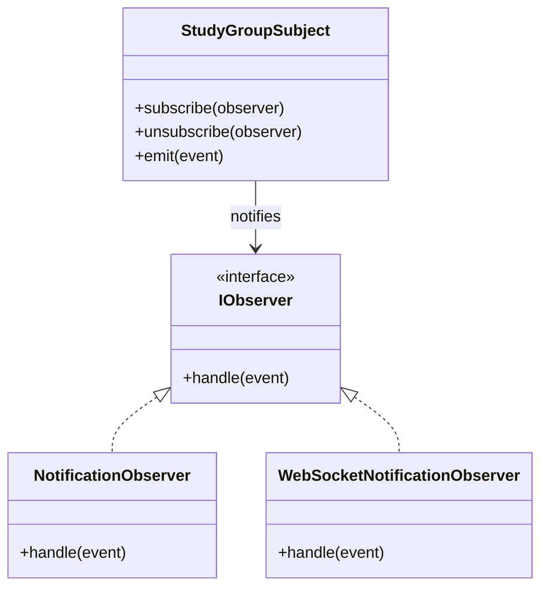

# study-groups service

Domain scope: US-009, US-012, US-013, US-017

Current status:
- Clean-architecture executable baseline implemented.
- HTTP routes:
	- `GET /health`
	- `GET /api/v1/study-groups?subjectId=&search=`
- 	- `GET /api/v1/study-groups/:id`
- 	- `POST /api/v1/study-groups`
- 	- `GET /api/v1/study-groups/:id/applications`
- 	- `POST /api/v1/study-groups/:id/apply`
- 	- `PUT /api/v1/study-groups/applications/:id/review`
- Uses a Postgres repository when DB env vars are configured.
- Falls back to an in-memory repository when local credentials are missing or still set to placeholders.
- Applications are modeled inside this service as part of the same domain boundary.
- Write flows currently use `x-user-id` as temporary actor identity until JWT middleware is introduced.

Layer responsibilities:
- `src/domain`: entities and repository contracts.
- `src/application`: use-cases orchestration.
- `src/infrastructure`: current data adapters (in-memory now, Postgres later).
- `src/interfaces`: HTTP controllers/routes/dto.

Observer UML:

Run locally:
- `pnpm --filter @uniconnect/study-groups dev`
