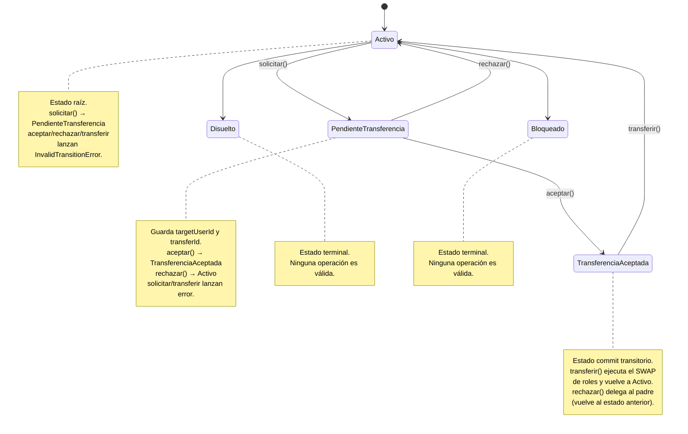
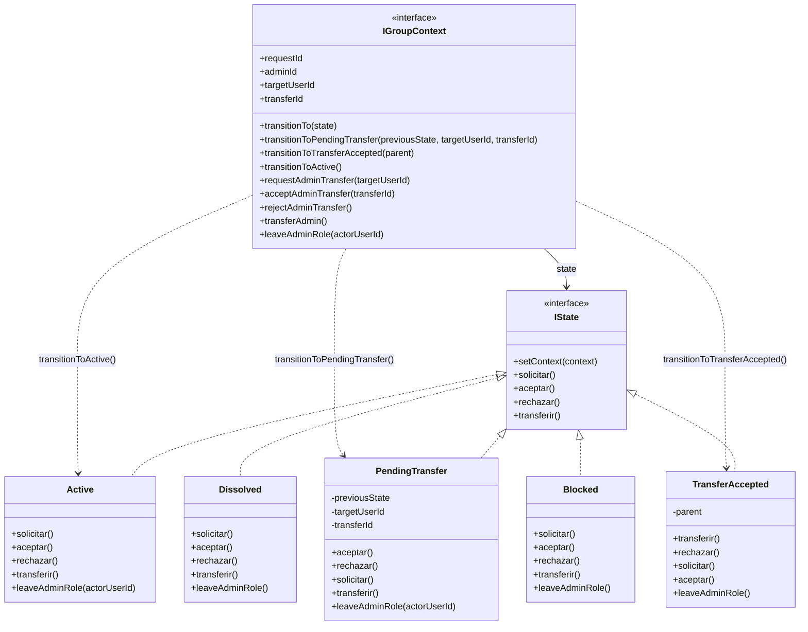
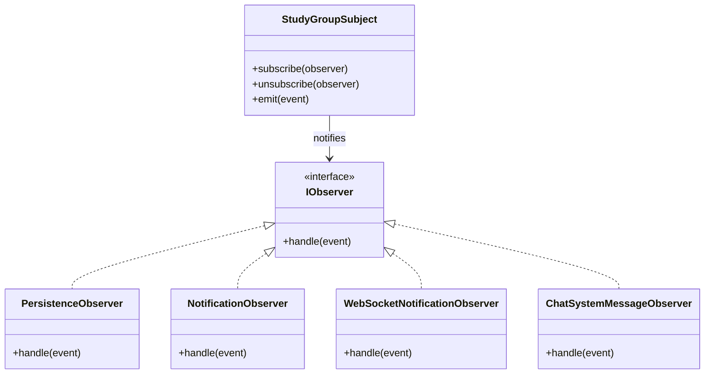

# study-groups service

Dominio funcional: US-009, US-012, US-013, US-017 — Administración de grupos, transferencias de admin, notificaciones y chat.

Capas (Arquitectura Limpia):
- `src/domain`: entidades (`StudyGroup`), contratos de repositorio, estados, eventos y observadores.
- `src/application`: casos de uso (orquestan lógica de dominio + persistencia).
- `src/infrastructure`: adaptadores de base de datos (Postgres e In-Memory).
- `src/interfaces`: controladores HTTP, rutas, DTOs.

## State Pattern — Transferencia de Administración

El patrón **State** modela el ciclo de vida de un `StudyGroup` mediante 5 estados concretos. Cada estado implementa la misma interfaz `IState` y valida qué operaciones están permitidas, lanzando error si se invoca una transición inválida.

**Estados:**

| Estado | Descripción |
|---|---|
| `Active` | Estado base. Se puede solicitar transferencia (`solicitar()`) o salir del rol admin (`leaveAdminRole()`). `aceptar/rechazar/transferir` lanzan error. |
| `PendingTransfer` | Transferencia solicitada, en espera de respuesta. Guarda `targetUserId` y `transferId`. Sólo `aceptar()` y `rechazar()` son válidas. |
| `TransferAccepted` | Estado "commit" transitorio. Inmediatamente después de `aceptar()`, el caso de uso llama a `transferir()` que ejecuta el SWAP de roles y vuelve a `Active`. |
| `Dissolved` | Estado terminal. El grupo fue disuelto. Todas las operaciones lanzan error. |
| `Blocked` | Estado terminal. El grupo fue bloqueado. Todas las operaciones lanzan error. |

**Flujo típico:** `Active` → `solicitar()` → `PendingTransfer` → `aceptar()` → `TransferAccepted` → `transferir()` → `Active` (SWAP de roles completado).

**Implementación:** El contexto (`StudyGroup` / `IGroupContext`) delega cada método al estado activo (`this._state.aceptar()`). Las transiciones se realizan mediante métodos `transitionTo*()` que reemplazan `this._state`. Cada estado solo conoce y puede transicionar a sus destinos directos, no a toda la máquina.

### Diagrama de Estados


```mermaid
stateDiagram-v2
    [*] --> Activo
    Activo --> PendienteTransferencia : solicitar()
    PendienteTransferencia --> TransferenciaAceptada : aceptar()
    PendienteTransferencia --> Activo : rechazar()
    TransferenciaAceptada --> Activo : transferir()
    Activo --> Disuelto
    Activo --> Bloqueado

    note right of Activo
        Estado raíz.
        solicitar() → PendienteTransferencia
        aceptar/rechazar/transferir
        lanzan InvalidTransitionError.
    end note

    note right of PendienteTransferencia
        Guarda targetUserId y transferId.
        aceptar() → TransferenciaAceptada
        rechazar() → Activo
        solicitar/transferir lanzan error.
    end note

    note right of TransferenciaAceptada
        Estado commit transitorio.
        transferir() ejecuta el SWAP
        de roles y vuelve a Activo.
        rechazar() delega al padre
        (vuelve al estado anterior).
    end note

    note right of Disuelto
        Estado terminal.
        Ninguna operación es válida.
    end note

    note right of Bloqueado
        Estado terminal.
        Ninguna operación es válida.
    end note
```

### Diagrama de Clases (State Pattern)


```mermaid
classDiagram
    class IGroupContext {
        <<interface>>
        +requestId
        +adminId
        +targetUserId
        +transferId
        +transitionTo(state)
        +transitionToPendingTransfer(previousState, targetUserId, transferId)
        +transitionToTransferAccepted(parent)
        +transitionToActive()
        +requestAdminTransfer(targetUserId)
        +acceptAdminTransfer(transferId)
        +rejectAdminTransfer()
        +transferAdmin()
        +leaveAdminRole(actorUserId)
    }

    class IState {
        <<interface>>
        +setContext(context)
        +solicitar()
        +aceptar()
        +rechazar()
        +transferir()
    }

    class Active {
        +solicitar()
        +aceptar()
        +rechazar()
        +transferir()
        +leaveAdminRole(actorUserId)
    }

    class PendingTransfer {
        -previousState
        -targetUserId
        -transferId
        +aceptar()
        +rechazar()
        +solicitar()
        +transferir()
        +leaveAdminRole(actorUserId)
    }

    class TransferAccepted {
        -parent
        +transferir()
        +rechazar()
        +solicitar()
        +aceptar()
        +leaveAdminRole()
    }

    class Dissolved {
        +solicitar()
        +aceptar()
        +rechazar()
        +transferir()
        +leaveAdminRole()
    }

    class Blocked {
        +solicitar()
        +aceptar()
        +rechazar()
        +transferir()
        +leaveAdminRole()
    }

    IGroupContext --> IState : state
    IState <|.. Active
    IState <|.. PendingTransfer
    IState <|.. TransferAccepted
    IState <|.. Dissolved
    IState <|.. Blocked
    IGroupContext ..> Active : transitionToActive()
    IGroupContext ..> PendingTransfer : transitionToPendingTransfer()
    IGroupContext ..> TransferAccepted : transitionToTransferAccepted()
```

### Contrato IState

```typescript
interface IState {
  setContext(context: IGroupContext): void;
  solicitar(): Promise<void>;
  aceptar(): Promise<void>;
  rechazar(): Promise<void>;
  transferir(): Promise<void>;
}
```

Los 4 métodos de transferencia no reciben parámetros — los datos viajan por las propiedades del contexto (`targetUserId`, `transferId`). Cada estado solo importa sus transiciones directas, garantizando atomicidad.

## Observer Pattern — Eventos de Dominio

El patrón **Observer** desacopla los efectos secundarios (notificaciones, persistencia, mensajes de sistema) de la lógica de dominio. El `StudyGroupSubject` emite eventos tipados y cada observador reacciona independientemente.

**Observadores actuales:**

| Observador | Escucha | Efecto |
|---|---|---|
| `PersistenceObserver` | `ADMIN_TRANSFER_ACCEPTED`, `ADMIN_ROLE_LEFT` | Persiste el cambio en BD mediante `accept_admin_transfer_backend()` / `leave_request_admin_backend()`. |
| `NotificationObserver` | Todos los eventos de transferencia | Crea notificaciones en `user_notifications` para el usuario destino. |
| `WebSocketNotificationObserver` | Todos los eventos de transferencia | Envía notificación en tiempo real vía WebSocket. |
| `ChatSystemMessageObserver` | `ADMIN_TRANSFER_REQUESTED`, `ACCEPTED`, `REJECTED`, `COMPLETED` | Inserta mensajes de sistema en `study_group_messages` para mantener el historial del chat. |

**Flujo:** `UseCase` → `group.aceptar()` → `context.emit(ADMIN_TRANSFER_ACCEPTED)` → cada observer maneja el evento de forma asíncrona e independiente. Si un observador falla, los demás continúan (aislamiento por `Promise.allSettled`).

### Diagrama de Clases (Observer)


```mermaid
classDiagram
    class StudyGroupSubject {
        +subscribe(observer)
        +unsubscribe(observer)
        +emit(event)
    }

    class IObserver {
        <<interface>>
        +handle(event)
    }

    class PersistenceObserver {
        +handle(event)
    }

    class NotificationObserver {
        +handle(event)
    }

    class WebSocketNotificationObserver {
        +handle(event)
    }

    class ChatSystemMessageObserver {
        +handle(event)
    }

    StudyGroupSubject --> IObserver : notifies
    IObserver <|.. PersistenceObserver
    IObserver <|.. NotificationObserver
    IObserver <|.. WebSocketNotificationObserver
    IObserver <|.. ChatSystemMessageObserver
```

## Persistencia de la Transferencia

La persistencia no ocurre en el observer sino en el propio caso de uso, de forma **síncrona**: `AcceptAdminTransfer.execute()` llama a `repository.acceptTransferAtomically()` después de `group.acceptAdminTransfer()` y antes de `group.transferAdmin()`. Esto garantiza que el `200 OK` solo se devuelve cuando la BD se actualizó realmente.

La función SQL `accept_admin_transfer_backend()` ejecuta los 4 UPDATEs (sin DELETE) con `SECURITY DEFINER` para esquivar RLS, equivalente al `service_role_key` del SDK de Supabase.

## Rutas HTTP

| Método | Ruta | Descripción |
|---|---|---|
| `GET` | `/health` | Health check |
| `GET` | `/api/v1/study-groups?subjectId=&search=` | Listar grupos |
| `GET` | `/api/v1/study-groups/:id` | Detalle del grupo |
| `POST` | `/api/v1/study-groups` | Crear grupo |
| `GET` | `/api/v1/study-groups/:id/applications` | Solicitudes de membresía |
| `POST` | `/api/v1/study-groups/:id/apply` | Postularse |
| `PUT` | `/api/v1/study-groups/applications/:id/review` | Revisar postulación |
| `PUT` | `/api/v1/study-groups/:id/request-admin-transfer` | Solicitar transferencia |
| `PUT` | `/api/v1/study-groups/:id/accept-admin-transfer/:transferId` | Aceptar transferencia |
| `PUT` | `/api/v1/study-groups/:id/reject-admin-transfer/:transferId` | Rechazar transferencia |
| `PUT` | `/api/v1/notifications/read-all` | Marcar notificaciones como leídas |

## Ejecutar Local

```bash
pnpm --filter @uniconnect/study-groups dev
```
