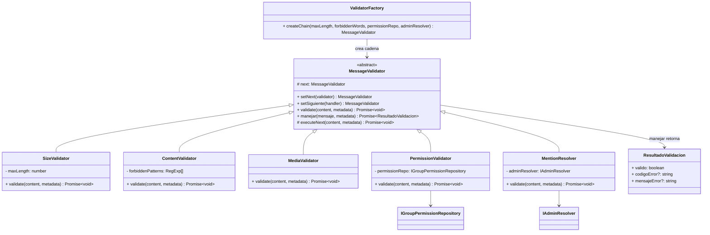
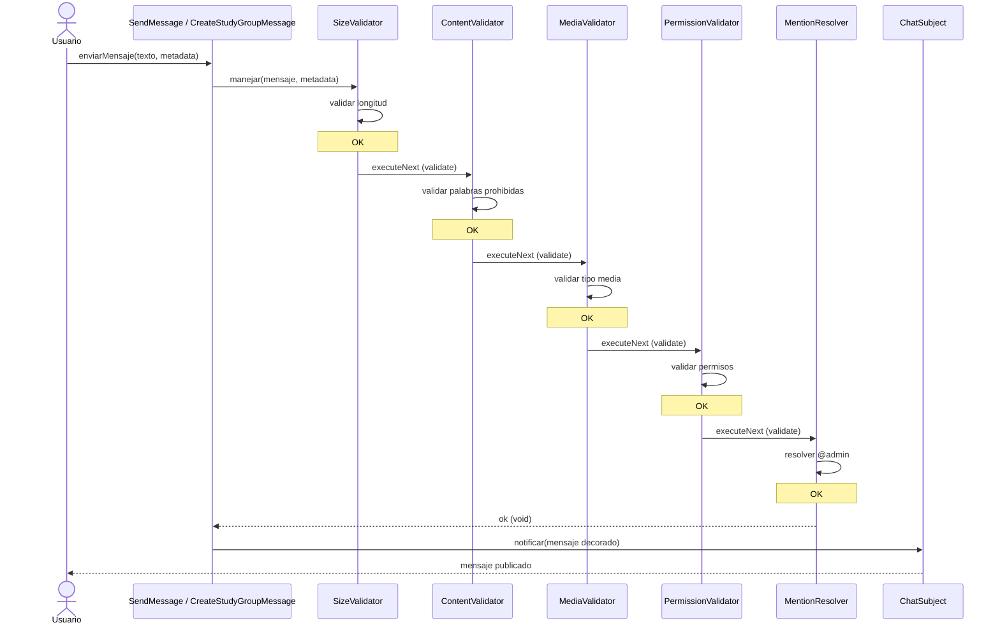
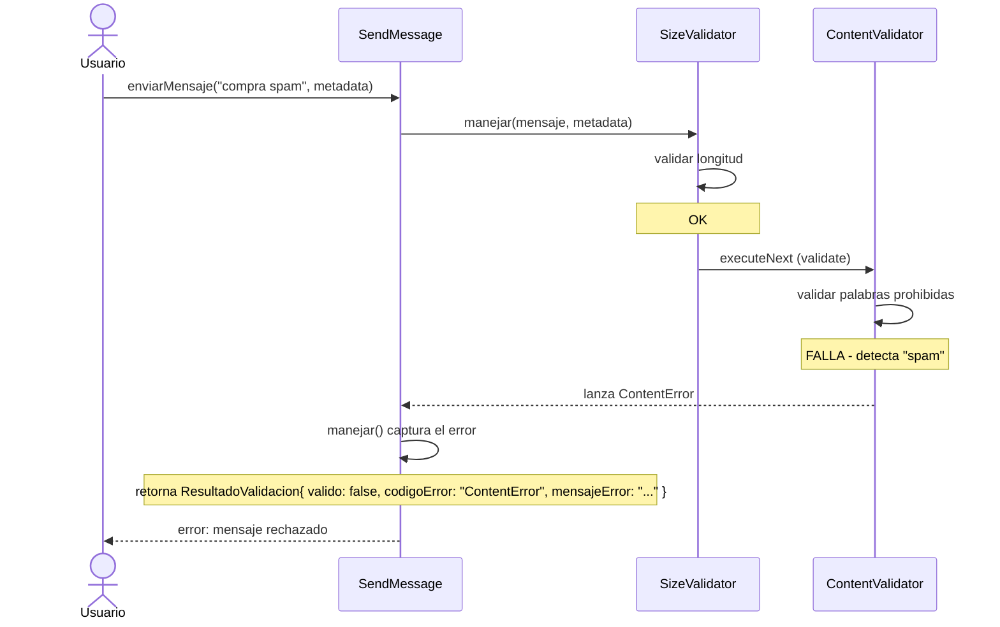

# CH01 — Chain of Responsibility: Validación de Mensajes

## Diagrama UML



## Diagrama de Secuencia

### Caso exitoso



### Caso con cortocircuito (fallo en ContentValidator)



## Estructura de Archivos

```
backend/shared/patterns/chain/message/
├── MessageValidator.ts        # Clase abstracta base
├── SizeValidator.ts           # Valida longitud del mensaje
├── ContentValidator.ts        # Filtra palabras prohibidas
├── MediaValidator.ts          # Valida tipo de archivo adjunto
├── PermissionValidator.ts     # Verifica permisos en grupos
├── MentionResolver.ts         # Resuelve menciones @admin
├── ValidatorFactory.ts        # Punto único de composición
├── ResultadoValidacion.ts     # Tipo de retorno de manejar()
├── index.ts                   # Barril de exportaciones
├── README.md                  # Este archivo
└── __tests__/
    └── validators.test.ts     # Tests unitarios
```
