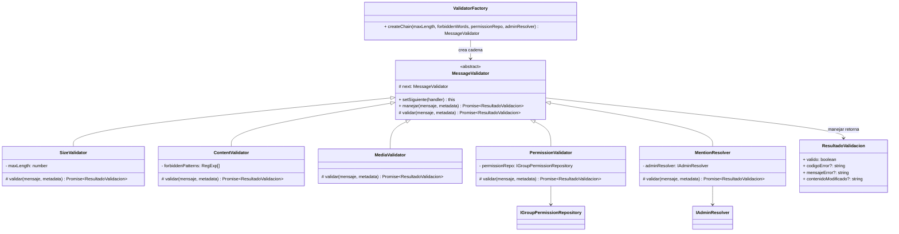
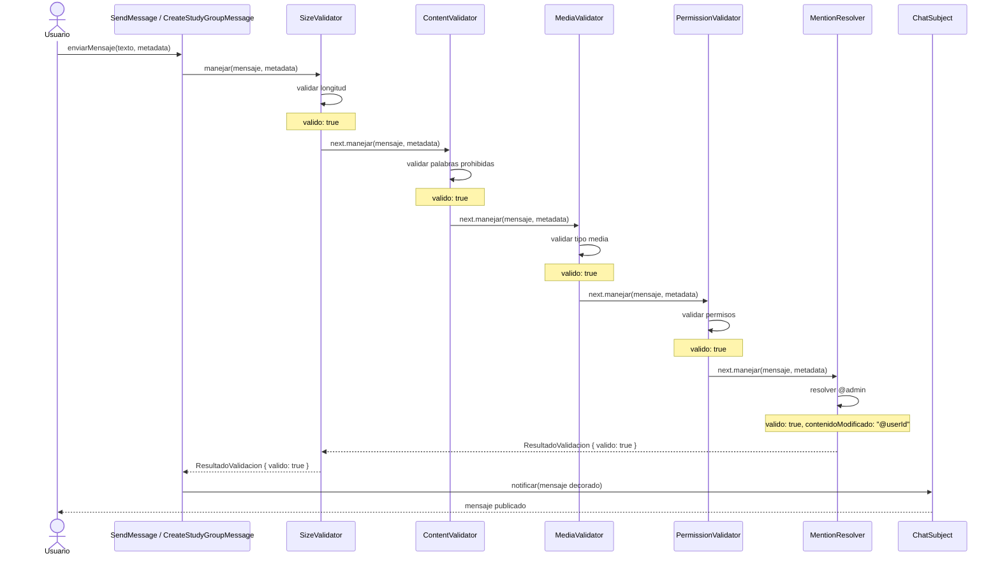
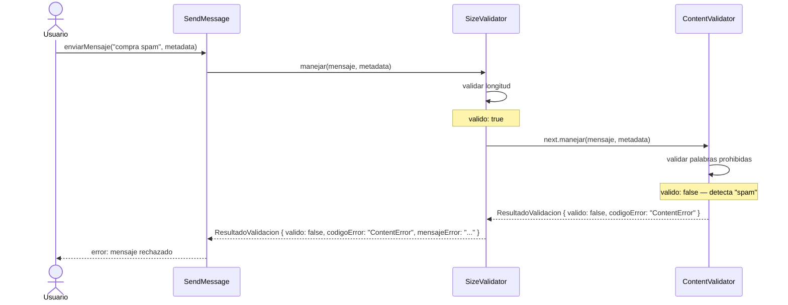

# CH01 — Chain of Responsibility: Validación de Mensajes

## Diagrama UML



## Diagrama de Secuencia

### Caso exitoso



### Caso con cortocircuito (fallo en ContentValidator)



## Principios del patrón

1. **Interfaz única**: Solo `manejar()` es público. Cada handler implementa `validar()` como método protegido que retorna `ResultadoValidacion`.

2. **Composición oculta**: `setSiguiente()` retorna `this` (no el siguiente handler), ocultando la estructura interna de la cadena.

3. **Cortocircuito**: Si `validar()` retorna `{ valido: false }`, la cadena se corta inmediatamente sin invocar al siguiente handler.

4. **Contenido modificado**: Los handlers pueden retornar `contenidoModificado` (ej: `MentionResolver` resuelve `@admin` → `@userId`), que se propaga al siguiente handler.

5. **Punto único de composición**: `ValidatorFactory.createChain()` es el único lugar donde se construye la cadena.

## Estructura de Archivos

```
backend/shared/patterns/chain/message/
├── MessageValidator.ts        # Clase abstracta base
├── SizeValidator.ts           # Valida longitud del mensaje
├── ContentValidator.ts        # Filtra palabras prohibidas
├── MediaValidator.ts          # Valida tipo de archivo adjunto
├── PermissionValidator.ts     # Verifica permisos en grupos
├── MentionResolver.ts         # Resuelve menciones @admin
├── ValidatorFactory.ts        # Punto único de composición
├── ResultadoValidacion.ts     # Tipo de retorno de manejar()
├── ValidationErrorHandler.ts  # Middleware para error handling
├── ValidationErrorMapper.ts   # Mapeo de errores a HTTP
├── index.ts                   # Barril de exportaciones
├── README.md                  # Este archivo
└── __tests__/
    └── validators.test.ts     # Tests unitarios
```