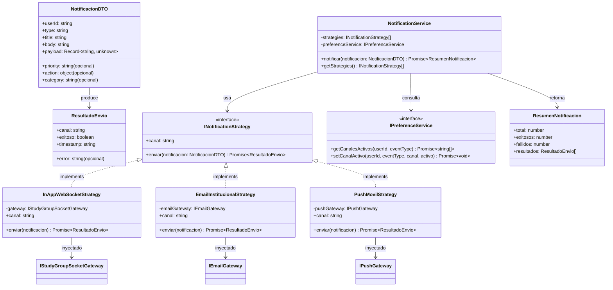

# Strategy Pattern — Notification Channels

## Overview

The Strategy pattern is used to encapsulate different notification delivery mechanisms (WebSocket, email, push notifications) behind a common interface. The `NotificationService` (Context) delegates the sending to the active strategies without knowing their concrete implementations.

## UML Diagram



## Structure

```
shared/patterns/strategy/
├── INotificationStrategy.ts          # Interface + DTOs
├── NotificationService.ts            # Context
├── InAppWebSocketStrategy.ts         # Concrete strategy 1
├── EmailInstitucionalStrategy.ts     # Concrete strategy 2
├── PushMovilStrategy.ts              # Concrete strategy 3
├── IPreferenceService.ts             # Preference query interface
├── index.ts                          # Barrel exports
├── README.md                         # This file
└── __tests__/
    └── notification-strategy.test.ts # Unit tests
```

## Usage

```typescript
import { NotificationService } from "./NotificationService.js";
import { InAppWebSocketStrategy } from "./InAppWebSocketStrategy.js";
import { EmailInstitucionalStrategy } from "./EmailInstitucionalStrategy.js";
import { PushMovilStrategy } from "./PushMovilStrategy.js";

// Compose strategies with their gateways
const strategies = [
  new InAppWebSocketStrategy(webSocketGateway),
  new EmailInstitucionalStrategy(emailGateway),
  new PushMovilStrategy(pushGateway),
];

// Create context
const service = new NotificationService(strategies, preferenceService);

// Send notification
const resumen = await service.notificar({
  userId: "user_abc",
  type: "SOLICITUD_INGRESO",
  title: "Nueva solicitud",
  body: "Tienes una nueva solicitud de ingreso",
  payload: { solicitudId: "123" },
});

console.log(resumen);
// { total: 3, exitosos: 2, fallidos: 1, resultados: [...] }
```

## Adding a New Strategy

1. Create a new class that implements `INotificationStrategy`.
2. Inject it into `NotificationService` at the composition root.
3. The existing code does not need modification (Open/Closed Principle).

```typescript
class SmsStrategy implements INotificationStrategy {
  readonly canal = "sms";

  constructor(private readonly smsGateway: ISmsGateway) {}

  async enviar(notificacion: NotificacionDTO): Promise<ResultadoEnvio> {
    try {
      await this.smsGateway.enviarSms(notificacion.userId, notificacion.body);
      return { canal: this.canal, exitoso: true, timestamp: new Date().toISOString() };
    } catch (error) {
      return { canal: this.canal, exitoso: false, error: (error as Error).message, timestamp: new Date().toISOString() };
    }
  }
}
```

## Acceptance Criteria

| AC   | Description                                                     |
|------|-----------------------------------------------------------------|
| AC01 | Mock implements `INotificationStrategy` and `NotificationService` accepts it |
| AC02 | Each concrete strategy has a defined `canal` and returns `ResultadoEnvio` |
| AC03 | `NotificationService` does not instantiate strategies internally |
| AC04 | Preference filtering — only active channels are executed        |
| AC05 | Fault isolation — one strategy fails, others continue           |
| AC06 | Open/Closed — new strategy added without modifying the context  |
