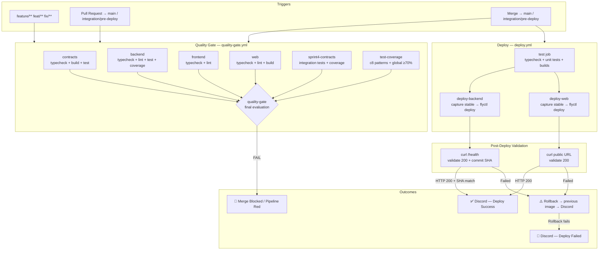

# CI/CD Pipeline — UniConnect

## Diagrama de Flujo

---

## Workflows

### 1. `quality-gate.yml` — Validacion de calidad

| Trigger | Comportamiento |
|---------|---------------|
| `push` a `feature/**`, `feat/**`, `fix/**` | Ejecuta todos los jobs. Si falla, el pipeline se marca en rojo |
| `pull_request` contra `main` o `integration/pre-deploy` | Idem. El merge queda bloqueado si el check es requerido en Branch Protection Rules |
| `push` a `main` o `integration/pre-deploy` | Idem, como verificacion adicional post-merge |

| Job | Que valida |
|-----|-----------|
| `contracts` | Typecheck + build + tests de contratos en `packages/shared-types` |
| `backend` | Typecheck + `pnpm lint` + tests de integracion de auth + umbral de cobertura (≥80% lines) |
| `frontend` | Typecheck + `pnpm lint` de la app movil (continue-on-error, no bloquea) |
| `web` | Typecheck + `pnpm lint` + build Vite del dashboard |
| `sprint4-contracts` | Tests de integracion Sprint 4 con Vitest + umbral de cobertura (≥80% lines) |
| `test-coverage` | Tests de patrones con c8 + `check-coverage.sh` (global ≥70%, Decorator+Observer ≥85%) |
| `quality-gate` | Agrega los 6 jobs anteriores. Si alguno falla → `exit 1` |

### 2. `deploy.yml` — Despliegue a Fly.io

| Trigger | Comportamiento |
|---------|---------------|
| `push` a `main` o `integration/pre-deploy` | Ejecuta el job `test` (typecheck + tests + builds). Si pasa, despliega backend y web en paralelo |

**Cada job de deploy** (`deploy-backend` / `deploy-web`) sigue esta secuencia:

| Step | Funcion |
|------|---------|
| **Capture stable** | Guarda la imagen del release activo actual (`flyctl releases --json`) |
| **Deploy** | `flyctl deploy --remote-only` con build args (COMMIT_SHA, secrets) |
| **Validate** | Curl con reintentos (18 para backend, 12 para web) al endpoint de salud |
| **Rollback** | `if: failure()` → `flyctl deploy --image <imagen_capturada> --strategy immediate` |
| **Notify** | `if: always()` → envia embed a Discord con el resultado |

| Proyecto | Imagen | URL de salud |
|----------|--------|-------------|
| Backend | `backend/Dockerfile` → monolito modular (gateway + 7 servicios) | `GET /health` → `{status, version, commit, deployedAt}` |
| Dashboard Web | `web/Dockerfile` → Vite build + Nginx Alpine | `GET /` → SPA servida por Nginx |

### 3. `e2e.yml` — Tests End-to-End

| Trigger | Comportamiento |
|---------|---------------|
| `push` a `main` o `integration/pre-deploy` | Ejecuta Playwright contra staging |
| `pull_request` contra `main` (paths: web/**, backend/**) | Idem |

Ejecuta tests E2E con Playwright en Chromium contra `https://uniconnect-dashboard-web.fly.dev`, usando credenciales de `TEST_USER_EMAIL` / `TEST_USER_PASSWORD`.

---

## Topologia de Entornos

| Entorno | Rama | Backend | Dashboard Web | Proposito |
|---------|------|---------|---------------|-----------|
| **Staging** | `integration/pre-deploy` | `uniconnect-backend-grupo-2.fly.dev` | `uniconnect-dashboard-web.fly.dev` | Pruebas pre-produccion antes del merge a main |
| **Production** | `main` | `uniconnect-backend-grupo-2.fly.dev` | `uniconnect-dashboard-web.fly.dev` | Trafico real de usuarios |

> **Nota:** Ambos entornos comparten las mismas apps de Fly.io. `integration/pre-deploy` permite validar el pipeline y los artefactos antes de hacer merge a `main`. En una fase futura se recomienda separar las apps por entorno (ej. `uniconnect-backend-staging` / `uniconnect-backend-prod`).

---

## Secretos de GitHub Actions

Configurar en **Settings → Secrets and variables → Actions → Repository secrets**:

| Secreto | Proyecto | Entorno | Descripcion | Donde obtenerlo |
|---------|----------|---------|-------------|-----------------|
| `FLY_API_TOKEN` | Backend + Web | Ambos | Token de autenticacion para Fly.io CLI | `flyctl auth token` en tu terminal, o Fly.io Dashboard → Account → Access Tokens |
| `DISCORD_WEBHOOK_URL` | Backend + Web | Ambos | URL del webhook para notificaciones de deploy | Discord → Server Settings → Integrations → Webhooks → New Webhook → Copy URL |
| `TEST_USER_EMAIL` | E2E | Staging | Email del usuario de prueba para Playwright | Crear una cuenta `@ucaldas.edu.co` dedicada a tests |
| `TEST_USER_PASSWORD` | E2E | Staging | Contrasena del usuario de prueba | La que se configure en Supabase Auth |
| `VITE_SUPABASE_URL` | Web | Ambos | URL del proyecto Supabase (publica, se embebe en el bundle) | Supabase Dashboard → Settings → API → Project URL |
| `VITE_SUPABASE_ANON_KEY` | Web | Ambos | Clave anonima/publica de Supabase | Supabase Dashboard → Settings → API → anon/public key |

---

## Como agregar un nuevo proyecto al pipeline

1. Crear un `fly.toml` con `[build] dockerfile`, `[env]` y `[[http_service.checks]]`
2. Agregar un nuevo job en `deploy.yml` siguiendo el patron de `deploy-backend`
3. Si tiene tests, agregar su job en `quality-gate.yml`
4. Agregar sus secretos en GitHub Settings
5. Actualizar la tabla de secretos en este documento

---

## Reglas de Branch Protection (configuracion manual)

Para que el quality gate bloquee merges en `main` e `integration/pre-deploy`:

1. **Settings → Branches → Add branch protection rule**
2. **Branch name pattern:** `main` (repetir para `integration/pre-deploy`)
3. Marcar:
   - `Require a pull request before merging`
   - `Require status checks to pass before merging`
   - Buscar y seleccionar `quality-gate` como check requerido
   - `Require conversation resolution before merging` (opcional)
4. Guardar
