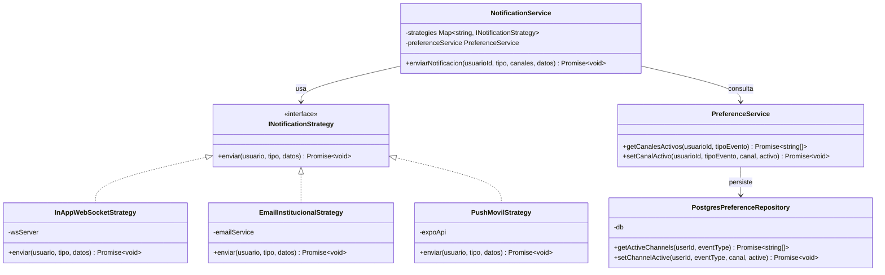

# US-S01: Sistema de Notificaciones Multicanal (Strategy Pattern)

## Diagrama de Clases UML



## Flujo de una notificación

1. Un caso de uso (ej. `ReviewApplication`) llama a `NotificationService.enviarNotificacion()`
2. `NotificationService` consulta `PreferenceService.getCanalesActivos()` para el usuario y tipo de evento
3. Por cada canal activo, ejecuta la estrategia correspondiente (`Promise.allSettled` para aislar errores)
4. Cada estrategia envía por su canal:
   - **InAppWebSocketStrategy**: inserta en `user_notifications` y emite por WebSocket a `canal_usuario_{userId}`
   - **EmailInstitucionalStrategy**: envía correo transaccional vía servicio SMTP
   - **PushMovilStrategy**: envía push vía Expo Push API usando `push_token` del perfil

## Base de datos

### Tabla `user_notification_preferences`

| Columna | Tipo | Descripción |
|---------|------|-------------|
| `id` | UUID PK | Identificador único |
| `user_id` | UUID FK → profiles.id | Usuario |
| `event_type` | VARCHAR | Tipo de evento (ej. `solicitud_ingreso`) |
| `canal` | VARCHAR | Canal (`in_app_websocket`, `email_institucional`, `push_movil`) |
| `active` | BOOLEAN | Si el canal está activo para este evento |
| `updated_at` | TIMESTAMPTZ | Última actualización |

## API HTTP

### `GET /api/v1/notifications/preferences`
Devuelve todas las preferencias del usuario autenticado.

Respuesta:
```json
{
  "data": {
    "preferences": [
      {
        "eventType": "solicitud_ingreso",
        "label": "Solicitud de ingreso",
        "channels": {
          "in_app_websocket": true,
          "email_institucional": false,
          "push_movil": true
        }
      }
    ]
  }
}
```

### `PUT /api/v1/notifications/preferences`
Actualiza una preferencia individual.

Cuerpo:
```json
{
  "eventType": "solicitud_ingreso",
  "canal": "email_institucional",
  "active": true
}
```

## Frontend

### Web (`/ajustes/notificaciones`)
- Tabla eventos × canales con checkboxes
- Optimistic update con rollback en error
- Componente `BellDropdown` en el header con badge de no leídos + dropdown de últimas 10 notificaciones

### Mobile (`/ajustes/notificaciones`)
- Misma tabla con `Switch` de React Native
- Modal `BellButton` accesible desde el perfil
- Push registrado automáticamente al login via `registerAndSavePushToken()`

## Tipos de evento

| Evento | Descripción |
|--------|-------------|
| `solicitud_ingreso` | Alguien solicita unirse a tu grupo |
| `miembro_aceptado` | Tu solicitud fue aceptada |
| `miembro_rechazado` | Tu solicitud fue rechazada |
| `transferencia_admin_solicitada` | Te piden ser admin |
| `transferencia_admin_aceptada` | El nuevo admin aceptó |
| `transferencia_admin_rechazada` | El nuevo admin rechazó |
| `transferencia_admin_transferida` | La transferencia se completó |
| `admin_role_left` | El admin renunció |
