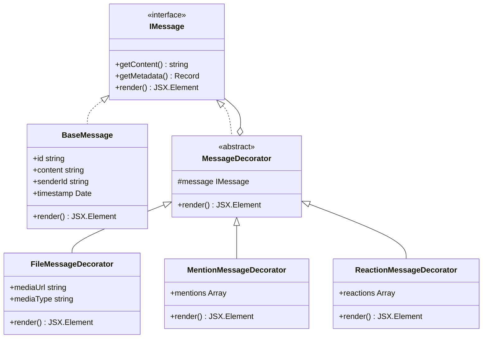

# Módulo de Chat - Patrón Decorator (US-D01)

Este módulo implementa el sistema de renderizado de mensajes del chat grupal utilizando el **Patrón de Diseño Decorator**. Esta arquitectura permite añadir capacidades visuales y de datos (archivos, menciones, reacciones) a los mensajes de forma modular y flexible sin modificar la clase base del mensaje.

## Arquitectura

La implementación se basa en una estructura de "cebolla" donde el mensaje base se envuelve dinámicamente según los metadatos disponibles.

### Diagrama de Clases (UML)



## Componentes Principales

1.  **IMessage**: Interfaz que define el contrato común para todos los mensajes y decoradores.
2.  **BaseMessage**: Implementación básica que renderiza el texto plano del mensaje.
3.  **MessageDecorator**: Clase abstracta que mantiene una referencia a un objeto `IMessage` y delega las llamadas por defecto.
4.  **Decoradores Concretos**:
    *   `FileMessageDecorator`: Añade soporte para previsualización de imágenes y archivos adjuntos.
    *   `MentionMessageDecorator`: Escanea el texto y aplica estilos de resaltado a los nombres de usuario mencionados.
    *   `ReactionMessageDecorator`: Renderiza la lista de reacciones (emojis y conteos) debajo del contenido del mensaje.
5.  **MessageFactory**: Centraliza la lógica de construcción, envolviendo el mensaje base con los decoradores necesarios basándose en el JSON recibido del servidor.

## Ventajas
- **Extensibilidad**: Para añadir un nuevo tipo de contenido (ej. encuestas), solo se necesita crear un nuevo decorador y registrarlo en la fábrica.
- **Single Responsibility**: Cada decorador se encarga de una única funcionalidad visual.
- **Composabilidad**: Un mismo mensaje puede tener simultáneamente un archivo, múltiples menciones y varias reacciones.
```typescript
// Ejemplo de composición automática
const decorated = new ReactionMessageDecorator(
    new MentionMessageDecorator(
        new FileMessageDecorator(baseMessage, fileData),
        mentionData
    ),
    reactionData
);
```
