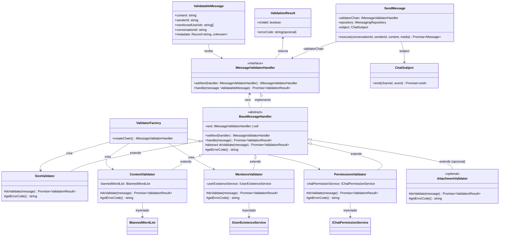
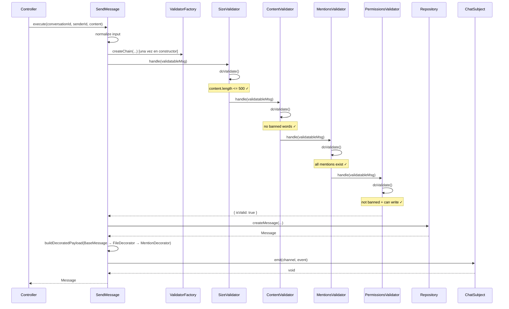
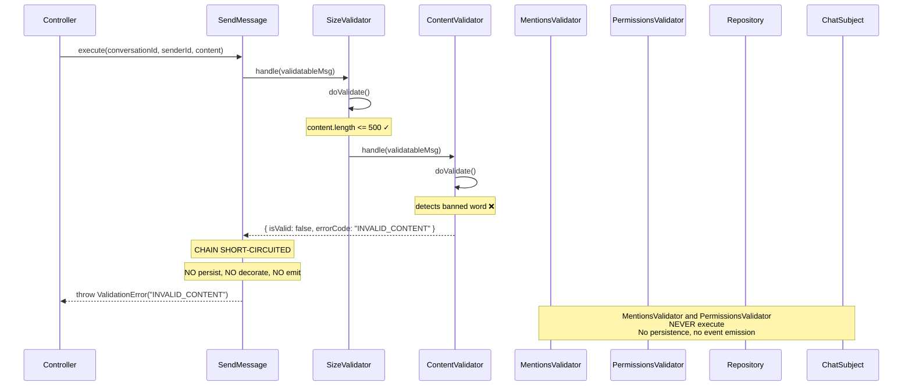

## Context

El microservicio `messaging` envía mensajes a través de `SendMessage` use case, que actualmente tiene validaciones inline dispersas (límite de caracteres, existencia de conversación) y luego construye un payload decorado (`BaseMessage` → `FileDecorator` → `MentionDecorator`) para emitirlo vía `ChatSubject` (Observer). No existe una cadena extensible de validación que permita agregar nuevos puntos de control sin modificar el use case ni los handlers existentes.

El patrón Chain of Responsibility resuelve esto definiendo una cadena de handlers independientes donde cada uno valida un aspecto específico del mensaje. Si un handler falla, corta la cadena y retorna el error inmediatamente. Si todos pasan, el mensaje continúa hacia el `ChatSubject` con los decoradores del Sprint 3.

## Goals / Non-Goals

**Goals:**
- Definir `IMessageValidatorHandler` como interfaz contrato con `setNext()` y `handle()`.
- Implementar `BaseMessageHandler` como clase abstracta con Template Method para el cortocircuito.
- Implementar 4 handlers concretos: `SizeValidator`, `ContentValidator`, `MentionsValidator`, `PermissionsValidator`.
- Implementar `ValidatorFactory` (composition root en `main.ts`) que construye la cadena en orden explícito.
- Integrar la cadena en `SendMessage` use case: si todas las validaciones pasan → persiste, decora, emite vía `ChatSubject`.
- Cubrir con tests unitarios y de integración.

**Non-Goals:**
- No se implementan gateways/servicios reales para `IUserExistenceService` o `IChatPermissionService` — se definen interfaces e implementaciones mock/in-memory para tests.
- No se modifica el `ChatSubject`, los observers, ni los decoradores existentes del Sprint 3.
- No se implementa un handler de adjuntos (`AttachmentValidator`) — se documenta cómo agregarlo.
- No se modifican las rutas HTTP ni controladores — solo la lógica de dominio y aplicación.

## Decisions

### 1. Ubicación

```
backend/services/messaging/src/domain/validation/
├── IMessageValidatorHandler.ts        # Interfaz + ValidationResult + ValidatableMessage
├── BaseMessageHandler.ts              # Clase abstracta con Template Method
├── SizeValidator.ts                   # Handler 1: máximo 500 caracteres
├── ContentValidator.ts                # Handler 2: filtro de palabras prohibidas
├── MentionsValidator.ts               # Handler 3: verificación de menciones
├── PermissionsValidator.ts            # Handler 4: ban/permiso de escritura
├── services/
│   ├── IBannedWordList.ts             # Interfaz para lista de bloqueo
│   ├── IUserExistenceService.ts       # Interfaz para verificar usuarios
│   └── IChatPermissionService.ts      # Interfaz para permisos/ban
├── ValidatorFactory.ts                # Punto único de composición de la cadena
├── index.ts                           # Barrel exports
└── __tests__/
    └── chain-of-responsibility.test.ts    # Tests unitarios + integración (33 tests)
```

Se elige `domain/validation/` dentro del microservicio `messaging` porque es lógica de dominio específica del chat.

### 2. Contrato de Interfaces

#### IMessageValidatorHandler

```typescript
// domain/validation/IMessageValidatorHandler.ts

export interface ValidationResult {
  readonly isValid: boolean;
  readonly errorCode?: string;
}

export interface ValidatableMessage {
  readonly content: string;
  readonly senderId: string;
  readonly mentionedUserIds: string[];
  readonly conversationId: string;
  readonly metadata: Record<string, unknown>;
}

export interface IMessageValidatorHandler {
  setNext(handler: IMessageValidatorHandler): IMessageValidatorHandler;
  handle(message: ValidatableMessage): Promise<ValidationResult>;
}
```

#### Servicios externos

```typescript
// domain/validation/services/IBannedWordList.ts
export interface IBannedWordList {
  containsBannedWord(text: string): Promise<boolean>;
}

// domain/validation/services/IUserExistenceService.ts
export interface IUserExistenceService {
  allUsersExist(userIds: string[]): Promise<boolean>;
}

// domain/validation/services/IChatPermissionService.ts
export interface IChatPermissionService {
  isUserBanned(userId: string, conversationId: string): Promise<boolean>;
  canWrite(userId: string, conversationId: string): Promise<boolean>;
}
```

### 3. Diagrama UML



### 4. BaseMessageHandler — Template Method

```typescript
// domain/validation/BaseMessageHandler.ts

export abstract class BaseMessageHandler implements IMessageValidatorHandler {
  private next: IMessageValidatorHandler | null = null;

  setNext(handler: IMessageValidatorHandler): IMessageValidatorHandler {
    this.next = handler;
    return handler;
  }

  async handle(message: ValidatableMessage): Promise<ValidationResult> {
    const result = await this.doValidate(message);

    if (!result.isValid) {
      return result;
    }

    if (this.next) {
      return this.next.handle(message);
    }

    return { isValid: true };
  }

  protected abstract doValidate(message: ValidatableMessage): Promise<ValidationResult>;
  protected abstract getErrorCode(): string;
}
```

### 5. Handlers Concretos

#### SizeValidator

```typescript
export class SizeValidator extends BaseMessageHandler {
  private static readonly MAX_LENGTH = 500;

  protected getErrorCode(): string {
    return "SIZE_EXCEEDED";
  }

  protected async doValidate(message: ValidatableMessage): Promise<ValidationResult> {
    if (message.content.length > SizeValidator.MAX_LENGTH) {
      return { isValid: false, errorCode: this.getErrorCode() };
    }
    return { isValid: true };
  }
}
```

#### ContentValidator

```typescript
export class ContentValidator extends BaseMessageHandler {
  constructor(private readonly bannedWordList: IBannedWordList) {
    super();
  }

  protected getErrorCode(): string {
    return "INVALID_CONTENT";
  }

  protected async doValidate(message: ValidatableMessage): Promise<ValidationResult> {
    const hasBanned = await this.bannedWordList.containsBannedWord(message.content);
    if (hasBanned) {
      return { isValid: false, errorCode: this.getErrorCode() };
    }
    return { isValid: true };
  }
}
```

#### MentionsValidator

```typescript
export class MentionsValidator extends BaseMessageHandler {
  constructor(private readonly userExistenceService: IUserExistenceService) {
    super();
  }

  protected getErrorCode(): string {
    return "USER_NOT_FOUND";
  }

  protected async doValidate(message: ValidatableMessage): Promise<ValidationResult> {
    if (message.mentionedUserIds.length === 0) {
      return { isValid: true };
    }

    const allExist = await this.userExistenceService.allUsersExist(message.mentionedUserIds);
    if (!allExist) {
      return { isValid: false, errorCode: this.getErrorCode() };
    }
    return { isValid: true };
  }
}
```

#### PermissionsValidator

```typescript
export class PermissionsValidator extends BaseMessageHandler {
  constructor(private readonly chatPermissionService: IChatPermissionService) {
    super();
  }

  protected getErrorCode(): string {
    return "NO_WRITE_PERMISSION";
  }

  protected async doValidate(message: ValidatableMessage): Promise<ValidationResult> {
    const isBanned = await this.chatPermissionService.isUserBanned(
      message.senderId,
      message.conversationId,
    );
    if (isBanned) {
      return { isValid: false, errorCode: "USER_BANNED" };
    }

    const canWrite = await this.chatPermissionService.canWrite(
      message.senderId,
      message.conversationId,
    );
    if (!canWrite) {
      return { isValid: false, errorCode: "NO_WRITE_PERMISSION" };
    }

    return { isValid: true };
  }
}
```

### 6. ValidatorFactory — Composition Root

```typescript
// domain/validation/ValidatorFactory.ts

export class ValidatorFactory {
  static createChain(
    bannedWordList: IBannedWordList,
    userExistenceService: IUserExistenceService,
    chatPermissionService: IChatPermissionService,
  ): IMessageValidatorHandler {
    const size = new SizeValidator();
    const content = new ContentValidator(bannedWordList);
    const mentions = new MentionsValidator(userExistenceService);
    const permissions = new PermissionsValidator(chatPermissionService);

    size.setNext(content)
        .setNext(mentions)
        .setNext(permissions);

    return size;
  }
}
```

### 7. Diagramas de Secuencia

#### Caso exitoso (pasa todos los handlers)



#### Caso con cortocircuito (falla en ContentValidator)



### 8. Integración con SendMessage

```typescript
// application/use-cases/SendMessage.ts

export class SendMessage {
  constructor(
    private readonly repository: IMessagingRepository,
    private readonly subject: ChatSubject,
    private readonly realtimeObserver: IChatObserver,
    private readonly idempotencyObserver: IChatObserver,
    private readonly validatorChain: IMessageValidatorHandler,
  ) {}

  async execute(
    conversationId: string,
    senderId: string,
    content: string,
    media?: MediaInput,
  ): Promise<Message> {
    // 1. Normalizar entrada
    const normalizedContent = content.trim();

    // 2. Validar mediante Chain of Responsibility
    const mentionIds = extractMentionsFromContent(normalizedContent).map(m => m.userId);
    const validatable: ValidatableMessage = {
      content: normalizedContent,
      senderId: senderId.trim(),
      mentionedUserIds: mentionIds,
      conversationId: conversationId.trim(),
      metadata: {},
    };

    const validation = await this.validatorChain.handle(validatable);

    if (!validation.isValid) {
      throw new ValidationError(validation.errorCode!);
    }

    // 3. Persistir (código existente)
    // 4. Decorar con BaseMessage → FileDecorator → MentionDecorator (código existente)
    // 5. Emitir vía ChatSubject (código existente)
  }

}
```

La extracción de `mentionedUserIds` se hace inline en `execute()` usando `extractMentionsFromContent()` de `mentionParser.ts` (mismo que usa `MentionDecorator`).

### 9. ValidationError

```typescript
// domain/validation/ValidationError.ts

export class ValidationError extends Error {
  constructor(
    public readonly code: string,
    message?: string,
  ) {
    super(message ?? `Validation failed: ${code}`);
    this.name = "ValidationError";
  }
}
```

### 10. Códigos de Error

| Handler | errorCode | Descripción |
|---|---|---|
| `SizeValidator` | `SIZE_EXCEEDED` | El mensaje excede los 500 caracteres |
| `ContentValidator` | `INVALID_CONTENT` | El contenido contiene palabras prohibidas |
| `MentionsValidator` | `USER_NOT_FOUND` | Uno o más usuarios mencionados no existen |
| `PermissionsValidator` | `USER_BANNED` | El usuario está baneado de la conversación |
| `PermissionsValidator` | `NO_WRITE_PERMISSION` | El usuario no tiene permiso de escritura |

### 11. Flujo de Validación

```
SendMessage.execute()
  │
  ├─ 1. ValidatorFactory.createChain() → [Size → Content → Mentions → Permissions]
  │
  ├─ 2. validatorChain.handle(validatableMessage)
  │      │
  │      ├─ SizeValidator.doValidate()
  │      │    └─ content.length > 500 ? return { isValid: false, errorCode: "SIZE_EXCEEDED" }
  │      │
  │      ├─ ContentValidator.doValidate()
  │      │    └─ bannedWordList.containsBannedWord(content) ? return { isValid: false, errorCode: "INVALID_CONTENT" }
  │      │
  │      ├─ MentionsValidator.doValidate()
  │      │    └─ !userExistenceService.allUsersExist(mentionedIds) ? return { isValid: false, errorCode: "USER_NOT_FOUND" }
  │      │
  │      └─ PermissionsValidator.doValidate()
  │           ├─ isUserBanned(senderId, conversationId) ? return { isValid: false, errorCode: "USER_BANNED" }
  │           └─ !canWrite(senderId, conversationId) ? return { isValid: false, errorCode: "NO_WRITE_PERMISSION" }
  │
  ├─ 3. Si validation.isValid === false → throw ValidationError(errorCode)
  │
  ├─ 4. persistir mensaje en repositorio
  ├─ 5. decorar con BaseMessage → FileDecorator → MentionDecorator
  └─ 6. ChatSubject.emit(channel, event) → RealtimeObserver + IdempotencyObserver
```

### 12. Principio Open/Closed

`SendMessage` trabaja contra la abstracción `IMessageValidatorHandler`. Nunca conoce los handlers concretos. Para añadir una nueva validación:

1. Crear una clase que extienda `BaseMessageHandler` e implemente `doValidate()`.
2. Añadirla en `ValidatorFactory.createChain()` en la posición deseada.

`SendMessage` no se modifica. Los handlers existentes no se modifican.

## Risks / Trade-offs

- **[Bajo]** `MentionsValidator` recibe los `mentionedUserIds` desde `SendMessage`, que los extrae vía `extractMentionsFromContent()` de `mentionParser.ts` (mismo parser que usa `MentionDecorator`). Si el parser cambia, ambos lugares deben sincronizarse.
- **[Bajo]** Los servicios `IBannedWordList`, `IUserExistenceService` e `IChatPermissionService` son interfaces nuevas que requieren implementaciones concretas (o mocks para tests). En producción se implementarán como adaptadores que consultan la base de datos u otros microservicios.
- **[Ninguno]** El patrón Chain of Responsibility está correctamente aplicado: `BaseMessageHandler` es la clase abstracta con Template Method, cada handler es independiente, y la cadena se construye en un único punto.
- **[Ninguno]** La integración con el `ChatSubject` y decoradores del Sprint 3 es no-invasiva: el `SendMessage` existente recibe la cadena por constructor y la ejecuta antes de persistir.
