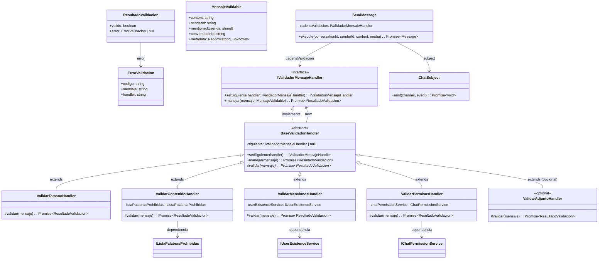
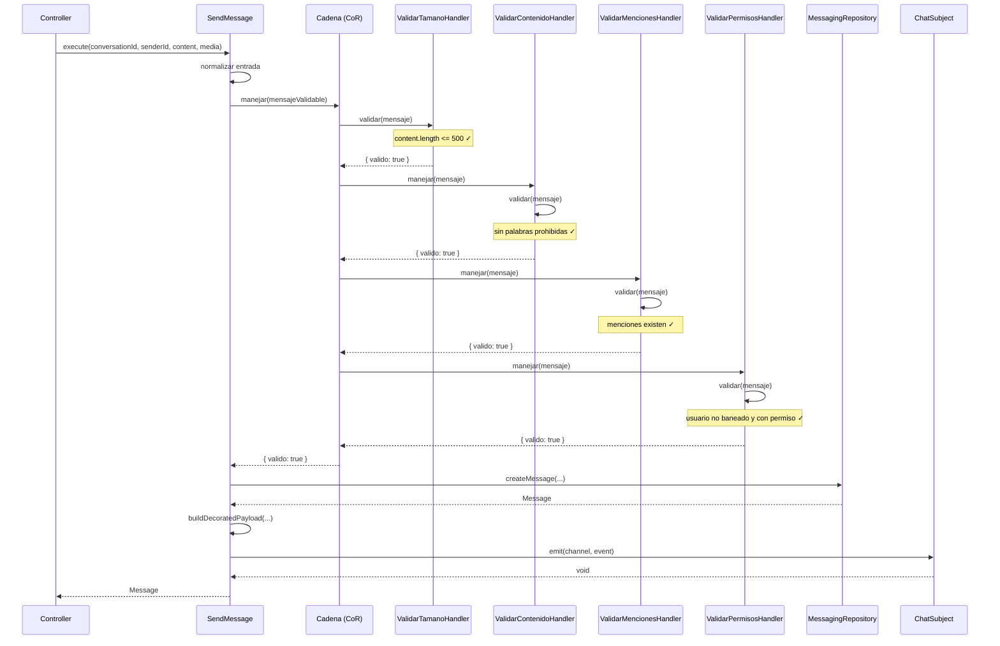

# Requirements — Chain of Responsibility para validación de mensajes (US-CH01)

## Objetivo

Aplicar el patrón **Chain of Responsibility** sobre la publicación de mensajes en el chat para que cada validación (tamaño, contenido, menciones, permisos) sea un handler independiente y la cadena pueda extenderse sin modificar los handlers existentes. Esto permite al equipo de desarrollo añadir o remover validaciones de forma limpia, siguiendo el principio Open/Closed.

---

## Contexto Arquitectónico

### Estado actual (Sprint 3 — Observer + Decorator)

El microservicio `messaging` ya implementa:

| Componente | Propósito |
|---|---|
| `ChatSubject` (Observer) | Emite eventos de mensaje (`NUEVO_MENSAJE`) por canal (DM / grupo) a observers como `RealtimeObserver` e `IdempotencyObserver` |
| `BaseMessage` + `MessageDecorator` (Decorator) | Compone mensajes con `FileDecorator`, `MentionDecorator`, `ReactionDecorator` antes de emitirlos en el evento |
| `SendMessage` use case | Orquesta: receptor → validación inline → repositorio → decoradores → `ChatSubject.emit()` |

**Problema actual**: Las validaciones están dispersas e inline dentro de `SendMessage.execute()` (límite de 5000 chars, existencia de conversación). No hay una cadena extensible ni handlers independientes.

**Solución**: Interceptar el flujo antes de llegar al `ChatSubject` con una cadena de handlers de validación. Si todos pasan, el mensaje decorado se entrega al `ChatSubject`. Si uno falla, se retorna error inmediatamente.

### Diagrama de contexto

```
SendMessage Use Case
    │
    ▼
┌─────────────────────────────────────────────────────┐
│           Chain of Responsibility                    │
│                                                      │
│  ValidarTamanoHandler ─► ValidarContenidoHandler     │
│       │                       │                      │
│       ▼                       ▼                      │
│  ValidarMencionesHandler ─► ValidarPermisosHandler   │
│       │                       │                      │
│       └───────────┬───────────┘                      │
│                   ▼                                  │
│           (todo OK)                                   │
└──────────────────────┬───────────────────────────────┘
                       │
                       ▼
            ┌─────────────────────┐
            │   ChatSubject       │
            │   (Observer —       │
            │    Sprint 3)        │
            └────────┬────────────┘
                     │
                     ▼
            ┌─────────────────────┐
            │   RealtimeObserver  │
            │   IdempotencyObs.   │
            └─────────────────────┘
```

---

## 1. Definición del Eslabón — `IValidadorMensajeHandler`

### 1.1 Interfaz

```typescript
// domain/validation/IValidadorMensajeHandler.ts

export interface ResultadoValidacion {
  readonly valido: boolean;
  readonly error?: {
    readonly codigo: string;       // Ej: "TAMANO_EXCEDIDO", "CONTENIDO_BLOQUEADO"
    readonly mensaje: string;      // Descripción legible del error
    readonly handler: string;      // Nombre del handler que rechazó
  };
}

export interface IValidadorMensajeHandler {
  /**
   * Asigna el siguiente handler en la cadena.
   * Retorna el handler asignado para permitir encadenamiento fluido (fluent API).
   */
  setSiguiente(handler: IValidadorMensajeHandler): IValidadorMensajeHandler;

  /**
   * Ejecuta la validación del handler actual.
   * - Si pasa: delega al siguiente handler (si existe) o retorna OK.
   * - Si falla: retorna ResultadoValidacion con error inmediatamente (cortocircuito).
   */
  manejar(mensaje: MensajeValidable): Promise<ResultadoValidacion>;
}
```

### 1.2 Contrato

- `setSiguiente(handler)` recibe el siguiente eslabón y lo retorna para permitir `handler1.setSiguiente(handler2).setSiguiente(handler3)`.
- `manejar(mensaje)` ejecuta la validación y decide: **pasar al siguiente** (si `valido = true`) o **cortar la cadena** (si `valido = false`).
- El `MensajeValidable` es un DTO que contiene los datos necesarios para todas las validaciones (ver sección 1.3).

### 1.3 `MensajeValidable` — DTO de entrada

```typescript
export interface MensajeValidable {
  readonly content: string;
  readonly senderId: string;
  readonly mentionedUserIds: string[];
  readonly conversationId: string;
  // Metadata adicional que los handlers pueden enriquecer
  readonly metadata: Record<string, unknown>;
}
```

---

## 2. Los Cuatro Guardias — Handlers Concretos

### 2.1 `ValidarTamanoHandler`

| Aspecto | Detalle |
|---|---|
| **Responsabilidad** | Validar que el mensaje no exceda los 500 caracteres (máximo definido para el chat académico) |
| **Código de error** | `"TAMANO_EXCEDIDO"` |
| **Regla** | `content.length > 500` → inválido |
| **Comportamiento** | Si `content.length <= 500`, pasa al siguiente handler. Caso contrario, corta la cadena. |

### 2.2 `ValidarContenidoHandler`

| Aspecto | Detalle |
|---|---|
| **Responsabilidad** | Filtrar palabras prohibidas (spam, insultos, contenido inapropiado) |
| **Código de error** | `"CONTENIDO_BLOQUEADO"` |
| **Regla** | Si el contenido contiene palabras de una lista de bloqueo → inválido |
| **Dependencia** | `IListaPalabrasProhibidas` — repositorio/service que provee la lista (puede ser archivo, BD, o servicio externo) |
| **Comportamiento** | Normaliza el texto a minúsculas, compara contra la lista. Si hay match, corta la cadena. |

### 2.3 `ValidarMencionesHandler`

| Aspecto | Detalle |
|---|---|
| **Responsabilidad** | Verificar que los usuarios mencionados en el mensaje existan en el sistema |
| **Código de error** | `"MENCIÓN_INEXISTENTE"` |
| **Regla** | Si `mentionedUserIds` contiene un ID que no existe en el sistema → inválido |
| **Dependencia** | `IUserExistenceService` — interfaz para verificar existencia de usuarios |
| **Comportamiento** | Recibe la lista de `mentionedUserIds` (extraída por el parser de menciones del `MentionDecorator`). Consulta existencia en lote. Si todos existen, pasa. Si alguno no existe, corta la cadena. |

### 2.4 `ValidarPermisosHandler`

| Aspecto | Detalle |
|---|---|
| **Responsabilidad** | Confirmar que el usuario no esté baneado y tenga permiso de escritura en la conversación |
| **Código de error** | `"USUARIO_BANEADO"` o `"SIN_PERMISO_ESCRITURA"` |
| **Regla** | Si el `senderId` está baneado o no tiene permiso de escritura en `conversationId` → inválido |
| **Dependencia** | `IChatPermissionService` — interfaz para verificar estado de ban y permisos de escritura |
| **Comportamiento** | Verifica primero si el usuario está baneado (código `"USUARIO_BANEADO"`). Si no, verifica permiso de escritura (código `"SIN_PERMISO_ESCRITURA"`). Si todo OK, pasa al siguiente. |

---

## 3. Lógica de Flujo — Cortocircuito y Entrega

### 3.1 Algoritmo del `manejar` base

La clase abstracta base implementa el Template Method para el cortocircuito:

```typescript
export abstract class BaseValidadorHandler implements IValidadorMensajeHandler {
  private siguiente: IValidadorMensajeHandler | null = null;

  setSiguiente(handler: IValidadorMensajeHandler): IValidadorMensajeHandler {
    this.siguiente = handler;
    return handler; // Fluent: permite next.setSiguiente(next2)
  }

  async manejar(mensaje: MensajeValidable): Promise<ResultadoValidacion> {
    // 1. Ejecutar validación local
    const resultado = await this.validar(mensaje);

    // 2. Si falló → cortocircuito inmediato
    if (!resultado.valido) {
      return resultado;
    }

    // 3. Si pasó y hay siguiente → delegar
    if (this.siguiente) {
      return this.siguiente.manejar(mensaje);
    }

    // 4. Fin de la cadena → OK
    return { valido: true };
  }

  // Cada subclase implementa su validación específica
  protected abstract validar(mensaje: MensajeValidable): Promise<ResultadoValidacion>;
}
```

### 3.2 Caso exitoso (pasa todas las validaciones)

```
manejar(mensaje)
  │
  ├─ ValidarTamanoHandler
  │    └─ content.length <= 500 → ✅ pasa
  │    └─ llama a siguiente.manejar(mensaje)
  │
  ├─ ValidarContenidoHandler
  │    └─ sin palabras prohibidas → ✅ pasa
  │    └─ llama a siguiente.manejar(mensaje)
  │
  ├─ ValidarMencionesHandler
  │    └─ todas las menciones existen → ✅ pasa
  │    └─ llama a siguiente.manejar(mensaje)
  │
  ├─ ValidarPermisosHandler
  │    └─ usuario no baneado y con permiso → ✅ pasa
  │    └─ no hay siguiente → retorna { valido: true }
  │
  ▼
Retorna { valido: true }
```

### 3.3 Caso con cortocircuito (falla en ValidarContenidoHandler)

```
manejar(mensaje)
  │
  ├─ ValidarTamanoHandler
  │    └─ content.length <= 500 → ✅ pasa
  │    └─ llama a siguiente.manejar(mensaje)
  │
  ├─ ValidarContenidoHandler
  │    └─ detecta palabra "spam123" en contenido → ❌ FALLA
  │    └─ CORTA LA CADENA inmediatamente
  │
  ▼
Retorna { valido: false, error: { codigo: "CONTENIDO_BLOQUEADO", handler: "ValidarContenidoHandler", ... } }
```

**Nota**: `ValidarMencionesHandler` y `ValidarPermisosHandler` nunca se ejecutan.

---

## 4. Integración con Sprint Anterior (Observer + Decorator)

### 4.1 Punto de integración

El `SendMessage` use case se modifica para usar la cadena de validación ANTES de persistir y emitir:

```typescript
export class SendMessage {
  constructor(
    private readonly repository: IMessagingRepository,
    private readonly subject: ChatSubject,
    private readonly realtimeObserver: IChatObserver,
    private readonly idempotencyObserver: IChatObserver,
    private readonly cadenaValidacion: IValidadorMensajeHandler,  // ← NUEVO
    private readonly userExistenceService: IUserExistenceService,   // ← NUEVO
  ) {}

  async execute(
    conversationId: string,
    senderId: string,
    content: string,
    media?: MediaInput,
  ): Promise<Message> {
    // 1. Normalizar entrada (ya existe)
    // 2. VALIDAR mediante Chain of Responsibility ← NUEVO
    const mensajeValidable: MensajeValidable = {
      content: normalizedContent,
      senderId: normalizedSenderId,
      mentionedUserIds: extractMentionIds(content),
      conversationId: normalizedConversationId,
      metadata: {},
    };

    const validacion = await this.cadenaValidacion.manejar(mensajeValidable);

    if (!validacion.valido) {
      throw new ValidationError(
        validacion.error!.codigo,
        validacion.error!.mensaje,
      );
    }

    // 3. Persistir mensaje (ya existe)
    // 4. Construir payload decorado con BaseMessage + FileDecorator + MentionDecorator (ya existe)
    // 5. Emitir evento via ChatSubject (ya existe)
  }
}
```

### 4.2 Flujo completo integrado

```
SendMessage.execute(dto)
  │
  ├─ 1. Normalizar entrada (trim, validar vacío)
  │
  ├─ 2. CHAIN OF RESPONSIBILITY (NUEVO)
  │    ├─ ValidarTamanoHandler     → corta si > 500 chars
  │    ├─ ValidarContenidoHandler  → corta si spam/insultos
  │    ├─ ValidarMencionesHandler  → corta si mención inexistente
  │    └─ ValidarPermisosHandler   → corta si baneado/sin permiso
  │
  │    Si falla → lanza ValidationError → controller responde 400
  │
  ├─ 3. Persistir en repositorio (ya existe)
  │
  ├─ 4. Construir payload decorado (Sprint 3)
  │    ├─ new BaseMessage(...)
  │    ├─ new FileDecorator(...) si media
  │    └─ new MentionDecorator(...) si menciones
  │
  └─ 5. Emitir evento via ChatSubject (Sprint 3)
       ├─ ChatSubject.emit(channel, event)
       ├─ RealtimeObserver → WebSocket broadcast
       └─ IdempotencyObserver → marca como procesado
```

### 4.3 Manejo de errores

| Escenario | Comportamiento |
|---|---|
| Todas las validaciones OK | Se persiste el mensaje, se decora con decoradores, se emite via `ChatSubject` |
| Falla `ValidarTamanoHandler` | Se lanza `ValidationError("TAMANO_EXCEDIDO")`. No se persiste ni emite nada |
| Falla `ValidarContenidoHandler` | Se lanza `ValidationError("CONTENIDO_BLOQUEADO")`. No se persiste ni emite nada |
| Falla `ValidarMencionesHandler` | Se lanza `ValidationError("MENCIÓN_INEXISTENTE")`. No se persiste ni emite nada |
| Falla `ValidarPermisosHandler` | Se lanza `ValidationError("USUARIO_BANEADO" o "SIN_PERMISO_ESCRITURA")`. No se persiste ni emite nada |

---

## 5. Composición de la Cadena — Punto Único (Factory / Composition Root)

### 5.1 Construcción en `main.ts`

```typescript
// main.ts — composition root del módulo de chat

function buildCadenaValidacion(
  listaPalabrasProhibidas: IListaPalabrasProhibidas,
  userExistenceService: IUserExistenceService,
  chatPermissionService: IChatPermissionService,
): IValidadorMensajeHandler {

  const tamano = new ValidarTamanoHandler();
  const contenido = new ValidarContenidoHandler(listaPalabrasProhibidas);
  const menciones = new ValidarMencionesHandler(userExistenceService);
  const permisos = new ValidarPermisosHandler(chatPermissionService);

  // El orden es explícito y se ve en este único punto
  tamano.setSiguiente(contenido)
        .setSiguiente(menciones)
        .setSiguiente(permisos);

  return tamano; // Retorna la cabeza de la cadena
}
```

### 5.2 Agregar un nuevo handler (ej: `ValidarAdjuntoHandler`)

```typescript
// Solo se modifica la composición en buildCadenaValidacion:
tamano.setSiguiente(contenido)
      .setSiguiente(menciones)
      .setSiguiente(permisos)
      .setSiguiente(new ValidarAdjuntoHandler(/* ... */));  // ← NUEVO, al final
```

No se modifica:
- `ValidarTamanoHandler`
- `ValidarContenidoHandler`
- `ValidarMencionesHandler`
- `ValidarPermisosHandler`
- `SendMessage` use case (ya recibe la cadena por constructor)

---

## 6. Criterios de Aceptación

### AC-01: Interfaz `IValidadorMensajeHandler` con `setSiguiente` y `manejar`

**DADO** que existe la interfaz `IValidadorMensajeHandler` con los métodos `setSiguiente(handler)` y `manejar(mensaje): ResultadoValidacion`

**CUANDO** se valida el requerimiento en el flujo correspondiente

**ENTONCES** el sistema cumple la condición descrita

**Validación**: Test unitario que crea un mock implementando `IValidadorMensajeHandler` y verifica que ambos métodos existen con las firmas correctas.

---

### AC-02: Cuatro handlers concretos

**DADO** que existen al menos cuatro handlers concretos: `ValidarTamanoHandler`, `ValidarContenidoHandler`, `ValidarMencionesHandler` y `ValidarPermisosHandler`

**CUANDO** se valida el requerimiento en el flujo correspondiente

**ENTONCES** el sistema cumple la condición descrita

**Validación**: Tests unitarios que verifican que cada handler:
- Implementa `IValidadorMensajeHandler`
- Tiene lógica de validación específica
- Retorna `ResultadoValidacion` con `valido: false` y código de error cuando la regla se viola

---

### AC-03: Cadena construida en un único punto (factory / composition root)

**DADO** que la cadena se construye en un único punto del módulo de chat (factory o composition root)

**CUANDO** se inicializa el módulo

**ENTONCES** el orden de los handlers queda explícito y configurable

**Validación**: Test que:
1. Verifica que `buildCadenaValidacion()` (o equivalente) existe como punto único
2. Verifica que el orden retornado es: Tamano → Contenido → Menciones → Permisos
3. Verifica que cambiar el orden en ese punto cambia la ejecución

---

### AC-04: Cortocircuito al violar una regla

**DADO** que un mensaje viola una regla

**CUANDO** el handler responsable lo detecta

**ENTONCES** la cadena se corta y devuelve un `ResultadoValidacion` fallido con el código de error específico del handler que rechazó el mensaje

**Validación**: Test que:
1. Envía un mensaje que excede 500 caracteres
2. Verifica que `ValidarTamanoHandler` retorna `{ valido: false, error: { codigo: "TAMANO_EXCEDIDO" } }`
3. Verifica que los handlers siguientes **no** se ejecutan

---

### AC-05: Mensaje entregado al `ChatSubject` si todas las validaciones pasan

**DADO** que un mensaje pasa todas las validaciones

**CUANDO** el último handler termina

**ENTONCES** el mensaje se entrega al `ChatSubject` del Sprint 3 con los decoradores ya aplicados

**Validación**: Test de integración que:
1. Ejecuta `SendMessage.execute()` con datos válidos
2. Verifica que `ChatSubject.emit()` fue llamado
3. Verifica que el payload incluye datos de decoradores (`FileDecorator`, `MentionDecorator`)

---

### AC-06: Principio Open/Closed — nueva validación sin modificar existentes

**DADO** que se requiere agregar una validación nueva (por ejemplo `ValidarAdjuntoHandler`)

**CUANDO** se implementa la nueva clase

**ENTONCES** solo se modifica la composición de la cadena, no los handlers existentes

**Validación**: Test que:
1. Crea `ValidarAdjuntoHandler` implementando `IValidadorMensajeHandler`
2. Lo agrega al final de la cadena en `buildCadenaValidacion()`
3. Verifica que los 4 handlers originales funcionan igual que antes

---

### AC-07: README con diagramas UML y de secuencia

**DADO** que el README del módulo de chat

**CUANDO** se documenta el patrón

**ENTONCES** incluye el diagrama UML y un diagrama de secuencia mostrando un caso exitoso y uno con cortocircuito

**Validación**: Verificación manual del README.md del módulo de messaging.

---

## 7. Diagramas para README

### 7.1 Diagrama UML de clases



### 7.2 Diagrama de secuencia — Caso exitoso



### 7.3 Diagrama de secuencia — Cortocircuito (falla en ValidarContenidoHandler)

```mermaid
sequenceDiagram
    participant C as Controller
    participant SM as SendMessage
    participant CH as Cadena (CoR)
    participant TH as ValidarTamanoHandler
    participant CH2 as ValidarContenidoHandler
    participant R as MessagingRepository
    participant CS as ChatSubject

    C->>SM: execute(conversationId, senderId, content, media)
    SM->>SM: normalizar entrada
    SM->>CH: manejar(mensajeValidable)
    
    CH->>TH: validar(mensaje)
    Note over TH: content.length <= 500 ✓
    TH-->>CH: { valido: true }
    
    CH->>CH2: manejar(mensaje)
    CH2->>CH2: validar(mensaje)
    Note over CH2: detecta palabra prohibida ❌
    CH2-->>CH: { valido: false, error: { codigo: "CONTENIDO_BLOQUEADO", ... } }
    
    Note over CH: CORTA LA CADENA
    CH-->>SM: { valido: false, error: { codigo: "CONTENIDO_BLOQUEADO", ... } }
    
    Note over SM: NO persiste, NO decora, NO emite
    
    SM-->>C: throws ValidationError("CONTENIDO_BLOQUEADO")
    
    Note over C,R,CS: ValidarMencionesHandler y ValidarPermisosHandler<br/>NUNCA se ejecutan<br/>No hay persistencia ni emisión
```

---

## 8. Estructura de Archivos Propuesta

```
backend/services/messaging/src/domain/validation/
├── IValidadorMensajeHandler.ts     # Interfaz del eslabón + ResultadoValidacion
├── MensajeValidable.ts             # DTO de entrada para la cadena
├── BaseValidadorHandler.ts         # Clase abstracta con Template Method
├── ValidarTamanoHandler.ts         # Handler 1: validación de tamaño
├── ValidarContenidoHandler.ts      # Handler 2: filtro de palabras prohibidas
├── ValidarMencionesHandler.ts      # Handler 3: verificación de menciones
├── ValidarPermisosHandler.ts       # Handler 4: ban/permiso de escritura
├── services/
│   ├── IListaPalabrasProhibidas.ts    # Interfaz para lista de bloqueo
│   ├── IUserExistenceService.ts       # Interfaz para verificar usuarios
│   └── IChatPermissionService.ts      # Interfaz para permisos/ban
├── index.ts                        # Barrel exports
└── ValidationError.ts             # Error tipado para respuestas HTTP 400

backend/services/messaging/src/domain/validation/__tests__/
├── chain-of-responsibility.test.ts     # Tests de integración de la cadena
├── ValidarTamanoHandler.test.ts        # Tests unitarios
├── ValidarContenidoHandler.test.ts
├── ValidarMencionesHandler.test.ts
└── ValidarPermisosHandler.test.ts
```

Se elige `domain/validation/` dentro del microservicio `messaging` porque es lógica de dominio específica del chat. Si en el futuro otros servicios necesitan validación similar, los handlers pueden moverse a `shared/patterns/chain-of-responsibility/`.

---

## 9. Dependencias Nuevas

| Dependencia | Propósito | ¿Nueva? |
|---|---|---|
| `IListaPalabrasProhibidas` | Provee lista de palabras bloqueadas (spam/insultos) | Sí |
| `IUserExistenceService` | Verifica si uno o más userIds existen en el sistema | Sí |
| `IChatPermissionService` | Verifica estado de ban y permiso de escritura en una conversación | Sí |

Ninguna dependencia externa nueva — solo interfaces definidas en el dominio.

---

## 10. Integración con `SendMessage` existente

El `SendMessage` use case actual tiene validaciones inline (límite de 5000 chars, verificación de conversación). Estas se conservan como pre-validaciones antes de la cadena. La cadena CoR reemplaza la validación dispersa y agrega los 4 nuevos puntos de control.

| Validación actual (inline) | Destino en CoR |
|---|---|
| `content.length > 5000` → error | Se reduce a 500 y se mueve a `ValidarTamanoHandler` |
| `!content && !mediaUrl` → error | Se conserva inline (pre-validación de entrada) |
| `conversation` no encontrada → error | Se conserva inline (pertenece al repositorio, no a validación de contenido) |
| (no existe) | `ValidarContenidoHandler` — nuevo |
| (no existe) | `ValidarMencionesHandler` — nuevo |
| (no existe) | `ValidarPermisosHandler` — nuevo |

---

## 11. Matriz de Trazabilidad — Cobertura de ACs

| AC | Descripción | Archivo(s) de implementación | Archivo(s) de prueba | Estado |
|---|---|---|---|---|
| **AC-01** | Interfaz `IValidadorMensajeHandler` con `setSiguiente` y `manejar` | `IMessageValidatorHandler.ts`, `BaseMessageHandler.ts` | `chain-of-responsibility.test.ts` (test 8a) | ✅ Cumplido |
| **AC-02** | Cuatro handlers concretos | `SizeValidator.ts`, `ContentValidator.ts`, `MentionsValidator.ts`, `PermissionsValidator.ts` | `chain-of-responsibility.test.ts` (tests 1-4) | ✅ Cumplido |
| **AC-03** | Cadena construida en punto único (factory) | `ValidatorFactory.ts` | `chain-of-responsibility.test.ts` (test 8) | ✅ Cumplido |
| **AC-04** | Cortocircuito al violar una regla | `BaseMessageHandler.ts` (Template Method) | `chain-of-responsibility.test.ts` (tests 5b-5f, 6) | ✅ Cumplido |
| **AC-05** | Mensaje entregado a `ChatSubject` si todo OK | `SendMessage.ts` (integración), `main.ts` (wiring) | `chain-of-responsibility.test.ts` (test 5a) | ✅ Cumplido |
| **AC-06** | Open/Closed — nuevo handler sin modificar existentes | `ValidatorFactory.ts` (punto único de composición) | `chain-of-responsibility.test.ts` (test 7) | ✅ Cumplido |
| **AC-07** | README con diagramas UML y de secuencia | `design.md` (diagramas Mermaid) | — (verificación manual) | ✅ Cumplido |

### Resumen de validación

```
🧪 Total de pruebas: 33
✅ Pasaron:          33
❌ Fallaron:         0
🧬 TypeScript:       Sin errores (npx tsc --noEmit)
```

Todos los criterios de aceptación de la US-CH01 están cubiertos por implementación y pruebas unitarias/integración.
